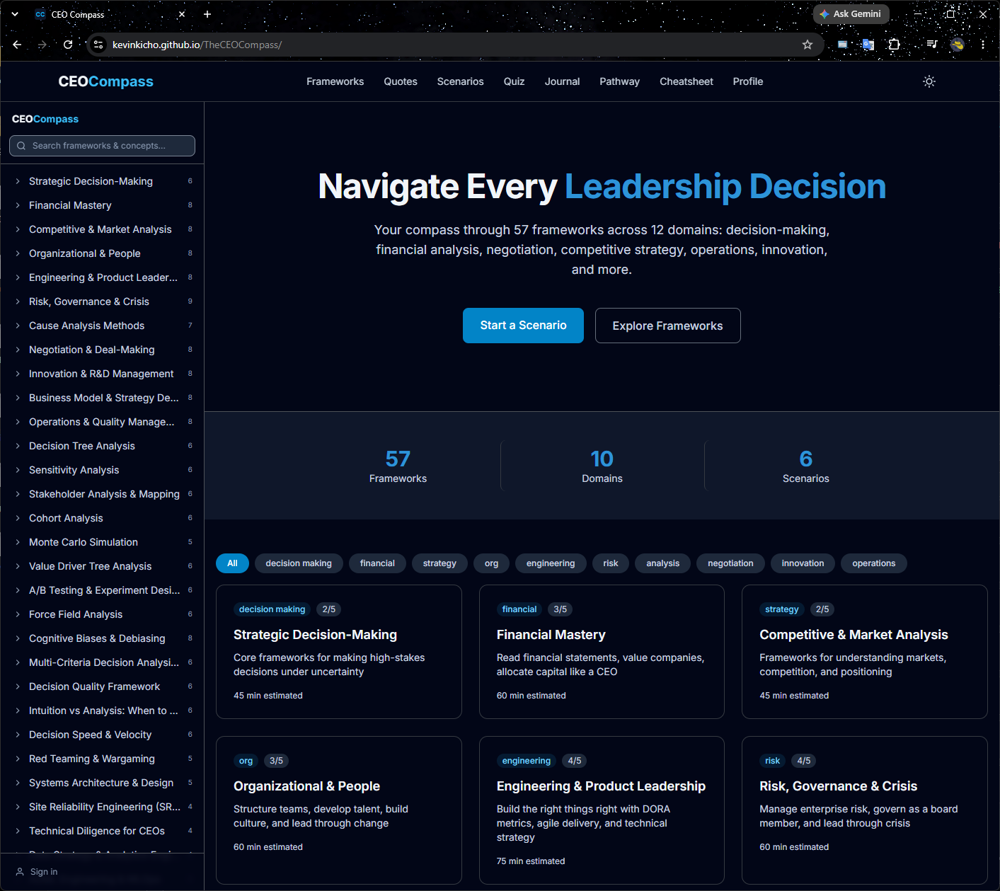
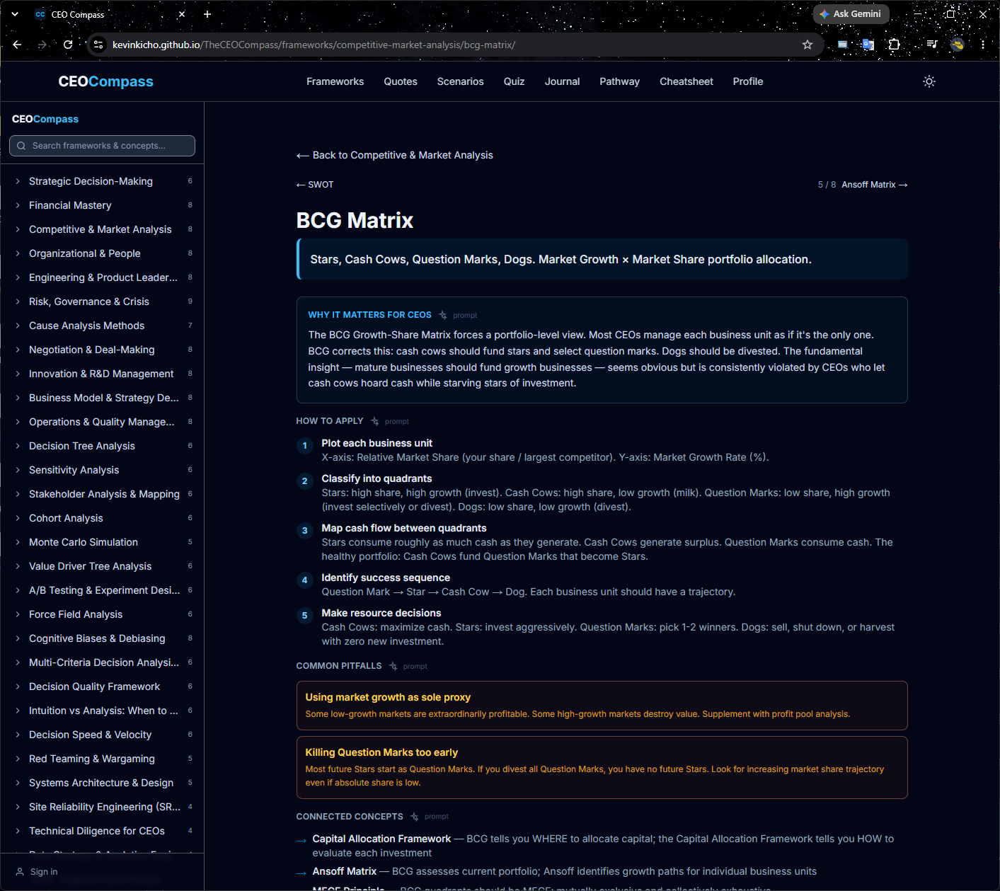
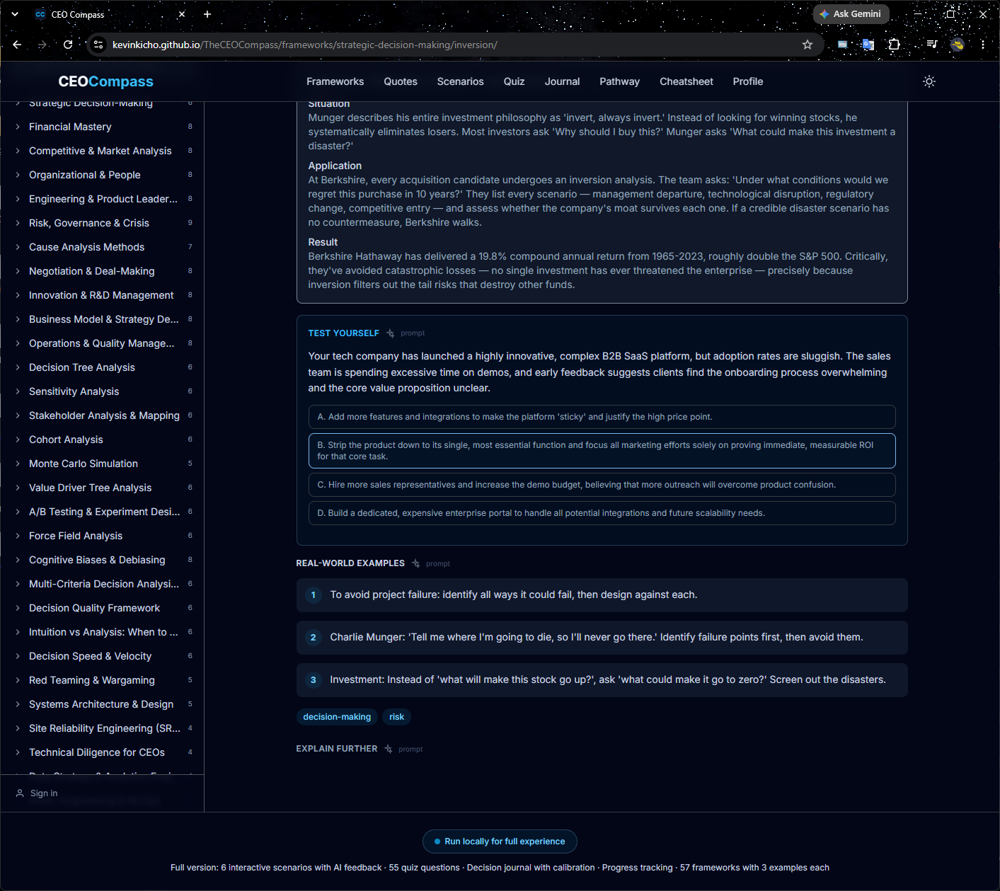
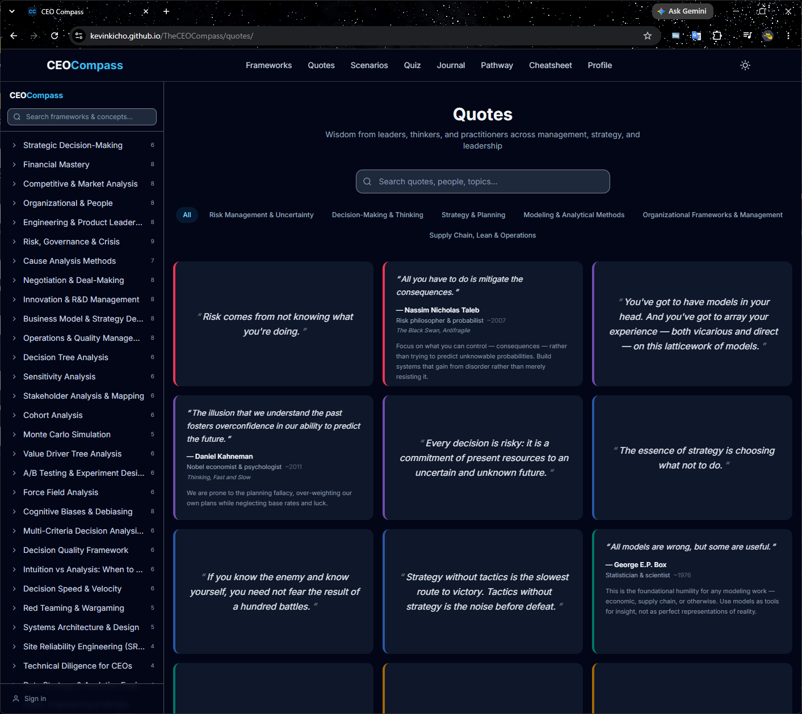

# CEO Compass

**[Live Demo →](https://kevinkicho.github.io/TheCEOCompass/)**

57 leadership frameworks, 282 concepts. AI-powered explanations, quiz, scenarios, quotes, decision journal, and learning pathway. Static GitHub Pages site with Firebase RTDB bridging to local Ollama.

<div align="center">
  <table>
    <tr>
      <td></td>
      <td></td>
    </tr>
    <tr>
      <td></td>
      <td></td>
    </tr>
  </table>
</div>

---

## Architecture

```
Browser (GitHub Pages)         Firebase RTDB          Local Agent (WSL)        Ollama
       │                           │                        │                    │
       ├── push /requests/ ──────► │                        │                    │
       │                           ├── onChildAdded ──────► │                    │
       │                           │                        ├── POST ──────────► │
       │                           │◄─── write result ──────┤                    │
       │◄─── onValue on                                            │
       │    framework/{s}/{c}/{category}/{id}                       │
```

8 content categories per concept, each stored at its own RTDB path:

```
framework/{slug}/{concept}/why_it_matters_for_ceos/{id}
framework/{slug}/{concept}/how_to_apply/{id}
framework/{slug}/{concept}/common_pitfalls/{id}
framework/{slug}/{concept}/connected_concepts/{id}
framework/{slug}/{concept}/case_study/{id}
framework/{slug}/{concept}/test_yourself/{id}
framework/{slug}/{concept}/real_world_examples/{id}
framework/{slug}/{concept}/explain_further/{id}
```

| Layer | Tech | Purpose |
|-------|------|---------|
| Frontend | Next.js 14 (static export) + TypeScript + Tailwind | 357 SSG pages, no backend |
| AI bridge | Firebase RTDB | Browser → Firebase → local agent → Ollama |
| Local agent | Node.js + firebase-admin | Watches `/requests`, calls `localhost:11434` |
| Auth | Firebase Auth (Google) | Admin for `kevinkicho@gmail.com` |
| Cache | Per-category RTDB paths | 24h TTL, loaded on mount via `onChildAdded` |

---

## Run Locally (Full Experience)

The live GitHub Pages demo serves the static UI, but AI-powered features (quiz generation, scenario coaching, concept enrichment, quotes) require the local Node.js agent + Ollama.

### Prerequisites

| Tool | Version | Purpose |
|------|---------|---------|
| [Node.js](https://nodejs.org/) | ≥ 18 | Frontend + agent |
| [Ollama](https://ollama.ai/) | Latest | Local LLM |
| Ollama model | `gemma4:latest` (or any chat model) | AI inference |
| Firebase service account | From [Firebase Console](https://console.firebase.google.com/) | RTDB write access |
| `.env` file | `frontend/.env` | Firebase config vars |

### Step-by-step

```bash
# 1. Clone and enter
git clone https://github.com/kevinkicho/TheCEOCompass.git
cd TheCEOCompass/ceo-platform

# 2. Start Ollama (Terminal 1)
ollama run gemma4:latest
# Keeps model loaded on port 11434

# 3. Start the agent (Terminal 2)
cd agent
npm install
# Place serviceAccountKey.json (from Firebase Console → Project Settings → Service Accounts) in agent/
node index.js
# Watches Firebase RTDB /requests, calls Ollama, writes results back

# 4. Start the frontend (Terminal 3)
cd frontend
cp .env.example .env   # fill in NEXT_PUBLIC_FIREBASE_* values
npm install
npm run dev            # → http://localhost:33221
```

### Verify everything is running

```bash
# Ollama responds
curl http://localhost:11434/api/tags
# → {"models": [{"name": "gemma4:latest", ...}]}

# Agent is listening (logs show)
# → Listening for requests at /requests

# Frontend loads
# → Open http://localhost:33221 in browser
```

### Firebase RTDB Security Rules

Features that persist data per-device (journal, pathway progress) need the following RTDB rules:

```json
{
  "rules": {
    "journal": {
      "$deviceId": { ".read": true, ".write": true }
    },
    "progress": {
      "$deviceId": { ".read": true, ".write": true }
    }
  }
}
```

Without these rules, journal and pathway show a "run locally" banner instead. All AI features (quiz, scenarios, concept generation, quotes) work once the agent is running.

---

---

## Routes

| Route | Content | Static |
|-------|---------|--------|
| `/` | Landing | ○ |
| `/frameworks` | Browse 57 frameworks | ○ |
| `/frameworks/[slug]` | Framework overview | ● 57 |
| `/frameworks/[slug]/[conceptSlug]` | Concept detail + AI | ● 282 |
| `/scenarios` | Browse 6 scenarios | ○ |
| `/scenarios/[slug]` | Scenario engine (AI coaching) | ● 6 |
| `/quiz` | AI-generated quiz | ○ |
| `/journal` | Decision journal (Firebase CRUD) | ○ |
| `/pathway` | Learning pathway (Firebase progress) | ○ |
| `/quotes` | Flip-card quotes + AI generation | ○ |
| `/profile` | Settings + Google Sign-In | ○ |
| `/cheatsheet` | Quick reference modal | ○ |

All 357 framework/concept/scenario pages statically generated at build time.

---

## Key Features

- **File-tree sidebar**: 57 frameworks with collapsible concept lists, pathname-based routing, mobile drawer
- **Per-category sparkle buttons**: Each content section has its own ✨ AI generation button with 2-click confirmation
- **Per-category pagination**: `< >` controls to flip through multiple cached AI responses for the same category
- **Real-time updates**: `onChildAdded` listeners pick up new AI responses without page refresh
- **Prompt tooltip**: Click the `prompt` link to see the exact prompt sent to Ollama (click-outside to close)
- **Concept enrichment**: All 282 concepts have CEO-focused `why_it_matters`, `steps`, `pitfalls`, `related_concepts`
- **Explain further**: 4-field AI explanation cards (real-world example, CEO insight, common mistake, quick tip)
- **Test yourself**: Interactive exercise with strategic explanation displayed after answering
- **Quiz generation**: Per-framework, AI-generated multiple-choice questions
- **Scenario engine**: Multi-stage branching scenarios with AI coaching feedback
- **Decision journal**: Full CRUD via Firebase RTDB with alternatives, assumptions, success metrics
- **Learning pathway**: Data-driven ordering, Firebase progress tracking, mark-done
- **Quotes page**: Flip cards with 20 static quotes + AI-generated quotes (admin edit/delete)
- **Error handling**: All AI features show visible red error banners with agent/timeout messages
- **120s timeout**: AI requests that don't get processed show a clear timeout error
- **Cooldown-free**: Immediate re-generation via 2-click confirmation (no timer lock)
- **Styled AI cards**: Color-coded by type with icons, dark mode
- **Show/hide prompt + admin edit**: View raw prompt text, admin can edit cached prompts
- **Google Sign-In**: Admin prompt editing on profile page

---

## RTDB Structure

```
requests/{requestId}          → { type, category, framework_slug, concept_slug, payload, status, created_at }
framework/{slug}/{concept}/
  why_it_matters_for_ceos/{id}  → { result, model, prompt, created_at }
  how_to_apply/{id}
  common_pitfalls/{id}
  connected_concepts/{id}
  case_study/{id}
  test_yourself/{id}
  real_world_examples/{id}
  explain_further/{id}
quotes/generated/{id}
scenario-evaluations/{id}
journal/{deviceId}/entries/{id}
progress/{deviceId}
```

No flat `/responses/{id}` path — agent writes directly to the category-specific path.

---

## Scripts

| Script | Purpose |
|--------|---------|
| `scripts/enrich-concepts.mjs` | Batch-generate enrichment fields via Ollama (282 concepts) |
| `scripts/enrich-explain.mjs` | Batch-generate explain_further content via Ollama |
| `scripts/sync-backend-seed.mjs` | Merge enriched data from backend seed into staticData.ts |
| `scripts/migrate-rtdb.mjs` | Migrate legacy RTDB paths to per-category paths |
| `scripts/push-enrichments-to-rtdb.mjs` | Push static enrichment data into RTDB |
| `scripts/generate-concept-ids.mjs` | Generate UUIDs for all concepts |

---

## File Structure

```
ceo-platform/
├── frontend/src/
│   ├── app/
│   │   ├── frameworks/[slug]/
│   │   │   ├── page.tsx              # Framework overview
│   │   │   └── [conceptSlug]/
│   │   │       └── page.tsx          # Concept detail + AI (8 category sections)
│   │   ├── quotes/page.tsx           # Flip-card quotes + AI generation
│   │   ├── journal/page.tsx          # Decision journal CRUD
│   │   ├── pathway/page.tsx          # Learning pathway
│   │   ├── quiz/page.tsx             # AI-generated quiz
│   │   ├── scenarios/[slug]/page.tsx # Scenario engine
│   │   └── profile/page.tsx          # Settings + auth
│   ├── components/
│   │   ├── AppSidebar.tsx            # File-tree sidebar
│   │   ├── Navbar.tsx                # Top nav (home, quotes, scenarios, etc.)
│   │   ├── ScenarioEngine.tsx        # Multi-stage branching + AI feedback
│   │   └── __tests__/                # Vitest test suites
│   └── lib/
│       ├── ollama.ts                 # AI: Firebase push/subscribe, cache, 8 generators
│       ├── firebase.ts               # Firebase init (RTDB + Auth)
│       ├── firebase-crud.ts          # Journal + pathway CRUD
│       ├── useAuth.ts                # Google Sign-In hook
│       ├── api.ts                    # Static framework data
│       ├── staticData.ts             # 57 frameworks, 282 concepts (enriched)
│       ├── types.ts                  # TypeScript interfaces
│       └── data/quotes.json          # 20 static quotes
├── agent/
│   ├── index.js                      # Firebase watcher → Ollama → per-category write
│   └── package.json
├── scripts/                          # Enrichment, migration, sync scripts
├── docs/
│   ├── DESIGN.md
│   ├── ENGINEERING.md
│   ├── MAINTENANCE.md
│   └── possible_directions.md        # Architecture alternatives (Firebase Functions, tunnel)
├── .github/workflows/
│   ├── ci.yml                        # Vitest + Next.js build
│   └── deploy.yml                    # Static export to GitHub Pages
└── AGENTS.md                         # AI agent dev instructions
```

---

## GitHub Secrets

| Secret | Required for |
|--------|-------------|
| `FIREBASE_API_KEY` | CI build + deploy |
| `FIREBASE_AUTH_DOMAIN` | CI build + deploy |
| `FIREBASE_DATABASE_URL` | CI build + deploy |
| `FIREBASE_PROJECT_ID` | CI build + deploy |
| `FIREBASE_STORAGE_BUCKET` | CI build + deploy |
| `FIREBASE_MESSAGING_SENDER_ID` | CI build + deploy |
| `FIREBASE_APP_ID` | CI build + deploy |

---

Built by **DeepSeek V4 Pro** via **OpenCode Go**.
