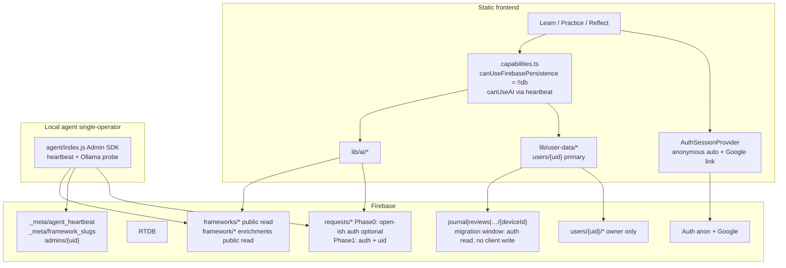
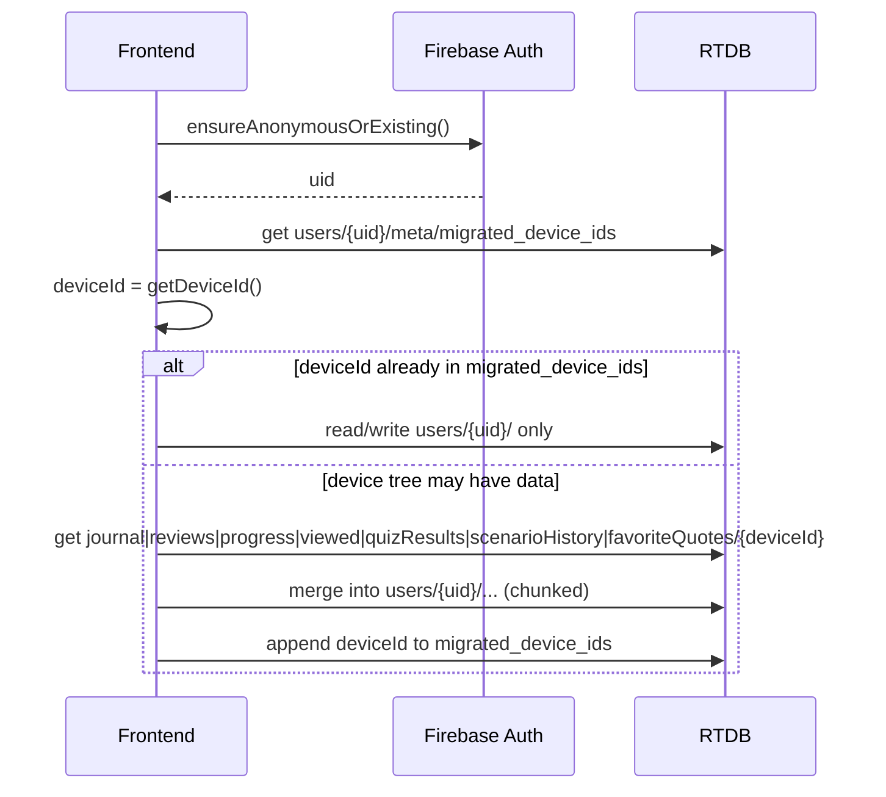
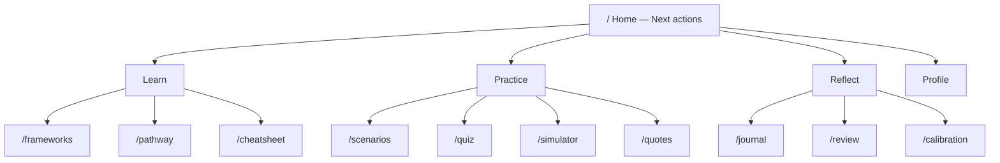
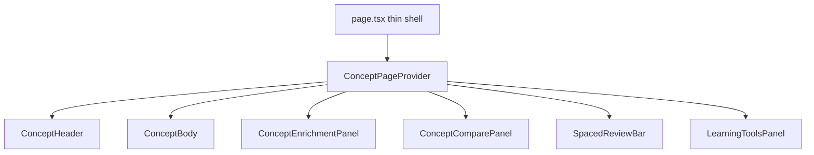

# CEO Compass — Phase 0–1 Platform Hardening + Product Spine

| Field | Value |
|-------|-------|
| **Document** | Phase 0–1 Platform Hardening + Product Spine Design |
| **Author** | TBD |
| **Date** | 2026-07-16 |
| **Status** | **Approved (Rev 4 — owner decisions incorporated)** |
| **Scope** | Phase 0 (Truth & Trust), Phase 1 (Identity & Continuity), Tracks A–C |
| **Live site** | https://kevinkicho.github.io/TheCEOCompass/ |
| **Repo** | TheCEOCompass (Next.js 14 static export + Firebase RTDB + local Ollama agent) |

---

## Overview

CEO Compass is a static-export Next.js 14 app on GitHub Pages. Framework content and AI orchestration already use Firebase Realtime Database (RTDB); personal learning data (journal, reviews, pathway, quiz, scenarios, favorites) is written via `firebase-crud.ts` under device-scoped paths using a `localStorage` UUID (`ceocompass_device_id`). Despite that, a single flag — `isStaticHosting` in `frontend/src/lib/constants.ts` — treats any non-localhost hostname as “demo mode” and **disables those Firebase-backed features on production**, showing “requires local backend” banners that are factually wrong.

This design restores production truth (Phase 0), then gives learners continuous identity and portable progress (Phase 1). It also specifies security hardening for currently open RTDB rules, an information-architecture (IA) spine of Learn / Practice / Reflect, and a modularization plan for the ~977-line concept page and oversized lib modules.

**Recommended security + identity default (Option A — implementable without further product debate):**

1. On first app load with Firebase configured, establish an **anonymous Firebase Auth session** (`signInAnonymously` — already exported from `frontend/src/lib/firebase.ts`, unused in product flows today).
2. Write learning data under **`users/{auth.uid}/...`** from day one of the cutover client (dual-read legacy device paths for one-shot migration).
3. **Lock RTDB rules** so private trees require `auth.uid === $uid`; retain top-level **device roots** only as short-lived migration sources (not a fictional `legacy_devices` root), then **final rules + purge** as soon as migration is stable.
4. **Google link/sign-in** upgrades the anonymous account (or merges into an existing Google uid) for cross-device continuity.
5. **AI request bus** (`requests/`) stays writable for authenticated users in a **later PR** after transport attaches `uid`; Phase 0 rules do **not** require `uid` on requests.
6. **Persistence banners** are removed only after auth session + user-scoped writes + intermediate rules are live.

**Production context (owner, 2026-07-16):** Site is production-staged but has **effectively no real users**. Prioritize clean architecture and aggressive cutover over multi-week compatibility windows.

**Non-goals for this document:** implementing the design; full cloud LLM productionization (Phase 2+); full mastery graph / scenario pack expansion (Phase 3).

---

## Background & Motivation

### Current architecture (verified)

```mermaid
flowchart LR
  subgraph Browser["GitHub Pages / localhost"]
    Next["Next.js static export"]
    LS["localStorage deviceId"]
  end
  subgraph Firebase["Firebase"]
    Auth["Auth Google popup/redirect"]
    RTDB["RTDB"]
  end
  subgraph Local["Developer machine"]
    Agent["agent/index.js"]
    Ollama["Ollama :11434"]
    Py["backend/ FastAPI — CI only"]
  end
  Next -->|"frameworks, AI requests, device data"| RTDB
  Next --> Auth
  Next --> LS
  Agent -->|"child_added requests/"| RTDB
  Agent --> Ollama
  Py -.->|"not used in production path"| Next
```



| Concern | Reality today | Key files |
|---------|---------------|-----------|
| Framework content | RTDB `frameworks/{slug}` + module cache | `frontend/src/lib/rtdb-cache.ts` |
| AI bus | Browser `set(requests/{id})` → agent → response path | `frontend/src/lib/ollama.ts`, `agent/index.js` |
| User learning data | `journal\|reviews\|progress\|viewed\|quizResults\|scenarioHistory\|favoriteQuotes/{deviceId}/...` | `frontend/src/lib/firebase-crud.ts` |
| Capability gate | `isStaticHosting = isServer \|\| !localhost` (always true on SSR) | `frontend/src/lib/constants.ts` |
| Auth | Google; admin = hardcoded `kevinkicho@gmail.com`; `signInAnonymously` exported unused | `frontend/src/lib/useAuth.ts`, `firebase.ts` |
| Scenarios (read) | Static JSON on hosting; FastAPI only on localhost | `frontend/src/lib/api.ts`, `frontend/src/data/scenarios.json` |
| Scenario evaluate | Ollama via RTDB (`evaluateScenarioStage`) — not FastAPI | `ScenarioEngine.tsx`, `ollama.ts` |
| Security | Effectively open write (`auth != null \|\| true`) | `database.rules.json` |
| Deploy | `deploy.yml` builds static export with Firebase secrets; **no backend job** | `.github/workflows/deploy.yml` |
| CI | `frontend-build` `needs: [backend-tests, frontend-tests]` | `.github/workflows/ci.yml` |

### Critical pain points

1. **Wrong product gates on production**  
   `isStaticHosting` is true on `kevinkicho.github.io` (and always true during SSR). It disables or banners: journal, pathway, calibration, review, quiz result persistence, scenario history, concept review UI, quotes favorites, profile blind-spot AI, scenarios banners. Those features call `firebase-crud.ts` (RTDB + deviceId), **not** the Python backend. Frameworks already load from Firebase on production. Banner copy in `RequiresBackend.tsx` (“Static Demo — requires local backend”) is incorrect for persistence features. `DemoFooter.tsx` globally claims journal/progress need a local run.

2. **Open RTDB**  
   Rules use `".write": "auth != null || true"` (always true) on AI/request paths and unauthenticated open read/write on all device-scoped trees. Anyone who obtains a `deviceId` (localStorage theft, XSS, shared machine, or a deviceId leaked into another public path) can read that journal and rewrite progress. UUID v4 is not practically enumerable; the risk is **known-id disclosure**, not brute-force listing.

3. **Dual identity**  
   Learning progress is anonymous-device; Google sign-in only unlocks admin affordances (`isAdmin`). Sign-in does not own or migrate progress. Navbar has no auth chrome (sign-in lives on Profile / AppSidebar only).

4. **God modules**  
   - Concept page: `frontend/src/app/frameworks/[slug]/[conceptSlug]/page.tsx` (~977 lines, **~36 `useState` calls**)  
   - AI client: `frontend/src/lib/ollama.ts` (~975 lines)  
   - User data: `frontend/src/lib/firebase-crud.ts` (~393 lines)

5. **IA dump**  
   `Navbar.tsx` exposes 11 peer `NAV_ITEMS` with no Learn/Practice/Reflect spine.

6. **Zombie backend**  
   `backend/` FastAPI still runs as a required CI job. Production path is RTDB + static scenarios. Deploy workflow does not run backend.

### Full `isStaticHosting` / banner call-site inventory (must reclassify)

| File | Usage class | Target capability |
|------|-------------|-------------------|
| `frontend/src/lib/constants.ts` | Definition (`isServer \|\| !localhost`) | Deprecate; remove hostname gate |
| `frontend/src/components/RequiresBackend.tsx` | Banner/modal/guard; re-exports flag | Split → persistence vs AI components |
| `frontend/src/lib/api.ts` | Catalog: static scenarios vs FastAPI; **re-exports `isStaticHosting`**; journal/progress/calibration stubs empty on static | Catalog: always static JSON on export; delete FastAPI journal/progress stubs; drop re-export |
| `frontend/src/app/journal/page.tsx` | Persistence block + banner | `canUseFirebasePersistence` |
| `frontend/src/app/pathway/page.tsx` | Persistence block + banner | `canUseFirebasePersistence` |
| `frontend/src/app/calibration/page.tsx` | Persistence block + banner | `canUseFirebasePersistence` |
| `frontend/src/app/review/page.tsx` | Persistence block + banner | `canUseFirebasePersistence` |
| `frontend/src/app/quiz/page.tsx` | Persistence (`saveQuizResult`) + banner | Persist → persistence; AI quiz gen → AI |
| `frontend/src/components/ScenarioEngine.tsx` | History load/save gated | **History → persistence**; evaluate stays AI (ungated by hostname) |
| `frontend/src/app/scenarios/page.tsx` | `StaticHostingBanner` (marketing/AI) | **AI** banner only if evaluate needs agent |
| `frontend/src/app/scenarios/[slug]/page.tsx` | `StaticHostingBanner` | **AI** for evaluate; history via ScenarioEngine persistence |
| `frontend/src/app/frameworks/[slug]/page.tsx` | Blocks `loadFrameworkProgress` | `canUseFirebasePersistence` |
| `frontend/src/app/frameworks/[slug]/[conceptSlug]/page.tsx` | Review load/UI gated; AI tools gated; **`markConceptViewed` already ungated** | Review/viewed → persistence; learning tools → AI |
| `frontend/src/app/quotes/page.tsx` | Favorites gated | Persistence |
| `frontend/src/app/simulator/page.tsx` | Full-page static banner | AI |
| `frontend/src/app/profile/page.tsx` | Blind-spot AI gated; stats via empty `api` stubs on static | Blind-spot → AI; **stats always RTDB user-data** (even localhost) |
| `frontend/src/components/DemoFooter.tsx` | Global “Run locally for full experience” — claims journal/progress need local | Rewrite: AI features need agent; persistence works on Pages |
| `frontend/src/components/__tests__/pages.test.tsx` | Mocks `isStaticHosting`, `StaticHostingBanner`, `BackendGuard`, `BackendRequiredModal` | Update mocks/exports when renaming |
| `frontend/src/lib/__tests__/*` | Indirect via mocked modules | Align with new flags |

---

## Goals & Non-Goals

### Goals

| Phase | Goal |
|-------|------|
| **0.0** | Rules unit tests / emulator harness **before** prod rules deploy |
| **0.1** | Split capability gates: Firebase persistence vs AI availability |
| **0.2** | Auth session gate: anonymous auto-session + Navbar sign-in chrome |
| **0.3** | User-scoped write (`users/{uid}`) + dual-read device-path migration |
| **0.4** | Intermediate RTDB rules (private data locked; device roots migration-readable; requests not yet uid-required) |
| **0.5** | Enable Firebase persistence UI on production (remove false banners) |
| **0.6** | Agent heartbeat + AI availability UI |
| **0.7** | Archive/demote Python backend in CI/docs |
| **1.1** | Google link for cross-device; multi-device merge re-entry |
| **1.2** | Finalize rules + **purge** legacy device trees as soon as migration code is stable (no calendar retention) |
| **1.3** | Export/import JSON of learning data |
| **1.4** | Auth-tagged AI requests + tighten `requests/` rules |
| **Track B** | Navbar → Learn / Practice / Reflect + Profile; home next actions |
| **Track C** | Decompose concept page, `ollama.ts`, `firebase-crud.ts` without big-bang |

### Non-Goals (this design only)

- **Phase 2:** Managed/cloud LLM as default production AI (pointer only).
- **Phase 3:** Mastery graph, large scenario pack expansion, SM-2 UX overhaul beyond enabling existing algorithm.
- Implementing code in this workstream — design only.
- Replacing Firebase RTDB with another datastore.
- Multi-operator agent fleets / multi-tenant AI backends.

---

## Safe cutover sequence (canonical — Option A)

This is the **only** recommended production path. Do not ship “enable persistence” and “target rules with users-only writes” on the same day without the prior steps live on Pages.

```mermaid
sequenceDiagram
  participant Dev as Developer
  participant Pages as GitHub Pages client
  participant Auth as Firebase Auth
  participant RTDB as RTDB
  participant Rules as rules deploy script

  Note over Dev: Wave A foundations
  Dev->>Dev: PR-A capabilities + pure splits + rules tests
  Dev->>Dev: PR-B AuthSessionProvider anonymous + Navbar CTA
  Dev->>Dev: PR-C user-data dual-read/write + migrateDevice→uid
  Dev->>Pages: Deploy user-scoped-write client (still under open rules OK briefly)
  Pages->>Auth: signInAnonymously if no user
  Pages->>RTDB: write users/{uid}/... only ; dual-read legacy device paths for migration
  Pages->>RTDB: migrate on session start

  Note over Dev: Wave B security + truth
  Dev->>Rules: PR-D intermediate rules + bootstrap admins/{ownerUid}
  Rules->>RTDB: deny-by-default private; device roots read auth-only write false
  Dev->>Pages: PR-E remove persistence banners (canUseFirebasePersistence)
  Dev->>Pages: PR-F heartbeat + AI banners only for AI

  Note over Dev: Wave C polish + Phase 1
  Dev->>Pages: Google link, export/import, IA, modularization
  Dev->>Rules: PR-H3 final rules deny device roots + Admin purge script
  Dev->>Pages: attach uid on requests; tighten requests rules
```

| Step | PR(s) | Live behavior |
|------|-------|---------------|
| 1 | PR-A capabilities, rules test harness, optional pure refactors | No prod behavior change |
| 2 | **PR-B Auth gate** | Anonymous session on load; Navbar Google CTA; sign-out policy; Console ops checklist |
| 3 | **PR-C User-scoped write + dual-read migration** | All **writes** → `users/{uid}` only; **reads** legacy `journal\|…/{deviceId}` for import (not dual-write) |
| 4 | **PR-D Intermediate rules + admin bootstrap** | **Production** rules PUT (backup + P0-T0 tests mandatory; no staging project required); private data locked; device roots auth-read for migration only; requests create-only |
| 5 | **PR-E Persistence enablement** | Remove false banners; journal etc. work on Pages |
| 6 | PR-F Heartbeat / AI UI; demote backend; profile always RTDB | AI truth UX |
| 7 | Phase 1: when migration stable → **final rules + purge** device trees; Google polish; export; request auth | Clean architecture; no multi-week retention |

**Rejected alternatives for cutover:**

| Option | Why not default |
|--------|-----------------|
| **B** Device trees write-open under locked rules | Cannot express “only my deviceId” without auth; still world-writable |
| **C** Ship persistence with open rules for N days | Explicit residual critical risk; only if owner signs written acceptance — **not recommended** |

---

## Proposed Design

### Target architecture



### Capability model (Phase 0 core)

**New module:** `frontend/src/lib/capabilities.ts`

```typescript
import { db } from "./firebase"

/**
 * True only when the Firebase RTDB client actually initialized.
 * Matches getDb() / firebase-crud behavior — NOT hostname, NOT a single env var.
 * firebase.ts requires apiKey + projectId (hasConfig); db is null otherwise.
 */
export function canUseFirebasePersistence(): boolean {
  return typeof window !== "undefined" && db != null
}

export type AiAvailability =
  | { status: "available"; mode: "agent" | "local"; ollamaOk: boolean }
  | { status: "unavailable"; reason: "no_heartbeat" | "stale" | "ollama_down" | "no_firebase" | "unknown" }

export const AGENT_HEARTBEAT_PATH = "_meta/agent_heartbeat"
/** Agent writes every 30s; UI treats stale after 90s. Allow ±120s clock skew buffer in comparison. */
export const AGENT_HEARTBEAT_STALE_MS = 90_000
export const AGENT_HEARTBEAT_SKEW_MS = 120_000

export type AgentHeartbeat = {
  status: "ok" | "degraded"
  updated_at: number
  ollama_ok: boolean
  ollama_checked_at?: number
  model_default?: string
  agent_version?: string
  hostname?: string // optional; last-writer-wins if multi-dev
}

export function canUseAIFromHeartbeat(
  heartbeat: AgentHeartbeat | null,
  localAiMode: boolean,
): boolean {
  if (localAiMode) return true
  if (!heartbeat) return false
  const age = Date.now() - heartbeat.updated_at
  if (age > AGENT_HEARTBEAT_STALE_MS + AGENT_HEARTBEAT_SKEW_MS) return false
  // Available for queueing only if ollama_ok; else show degraded "agent up, model down"
  return heartbeat.ollama_ok
}
```

**SSR note:** Never use hostname. On server, `canUseFirebasePersistence()` returns `false` (`window` undefined); client hydrates with real `db`. Persistence pages already use `"use client"`.

**Deprecation path for `isStaticHosting`:**

| Old use | New use |
|---------|---------|
| Gate journal/reviews/progress/quiz history/scenario history/viewed/favorites/calibration/review page | `canUseFirebasePersistence()` |
| Gate AI generators, learning tools, simulator evaluate | `canUseAI` / `AiUnavailableBanner` via `AiStatusProvider` |
| Choose static scenarios vs FastAPI in `api.ts` | Always use static catalog on export builds; optional FastAPI only if explicitly `NEXT_PUBLIC_USE_FASTAPI_SCENARIOS=true` (default false) |
| Banner “requires local backend” for journal | Remove; Firebase/error or sign-in messaging |
| `api.ts` re-export | Delete |

**Component renames:**

| Current | Target |
|---------|--------|
| `StaticHostingBanner` | `PersistenceUnavailableBanner` / `AiUnavailableBanner` |
| `BackendRequiredModal` | `AiSetupModal` — fix clone path to repo root (`cd TheCEOCompass` then `cd agent` / `cd frontend`; **not** `ceo-platform`) |
| `BackendGuard` | `AiGuard` |
| `DemoFooter` | Rewrite copy: persistence on Pages; AI needs local agent |

---

## Phase 0 tickets (file-level)

### P0-T0 — RTDB rules unit testing prerequisite

- **Files (new):**  
  - `frontend` or repo-root: Firebase emulator config if needed  
  - `tests/rtdb-rules/` or `frontend/src/lib/__tests__/database-rules.test.ts` using `@firebase/rules-unit-testing`  
  - Enhance `scripts/update-rtdb-rules.cjs`: dump/backup current rules to `database.rules.backup.json` before PUT; optional `--dry-run`
- **Cases required before any prod rules PUT:**  
  1. Unauth read `frameworks/{slug}` → allow  
  2. Unauth write `frameworks/...` → deny  
  3. Auth uid A R/W `users/A/journal/...` → allow  
  4. Auth uid A read `users/B/...` → deny  
  5. Auth client write `framework/{slug}/{concept}/explain_further/{id}` → deny  
  6. Auth read device `journal/{deviceId}/...` during intermediate rules → allow (migration)  
  7. Auth write device `journal/{deviceId}/...` intermediate → deny  
  8. Unauth create `requests/{id}` → **deny** (Phase 0: require `auth != null`; no `uid` field until P1-T5)  
  9. Auth A create `requests/{id}` with `status: pending` + required children → allow  
  10. Auth B **update** Auth A’s existing `requests/{id}` status (e.g. force `done` / `error`) → **deny** (create-only; agent Admin SDK only for status)  
  11. Auth client **update** existing `conceptChats/{id}` or `scenario-evaluations/{id}` → **deny** (create-only intermediate)  
  12. Auth client create new `conceptChats/{id}` / `scenario-evaluations/{id}` → allow  
- **Deploy (owner decision):** **Production** RTDB. Staging project **not required**. Mandatory: P0-T0 tests green + backup of current rules via `update-rtdb-rules.cjs` before PUT.
- **Risk:** Critical without this ticket.

### P0-T1 — Introduce capability flags

- **Files:** `frontend/src/lib/capabilities.ts` (new); `frontend/src/lib/constants.ts` (`@deprecated` alias one cycle); `frontend/src/lib/__tests__/capabilities.test.ts`
- **Implementation:** `canUseFirebasePersistence = typeof window !== "undefined" && db != null`
- **CI:** Pages/`deploy.yml` and `ci.yml` frontend-build must keep injecting full `NEXT_PUBLIC_FIREBASE_*` secrets so `db` is non-null in production builds.

### P0-T2 — Auth session gate (before persistence UI)

- **Files:**  
  - `frontend/src/lib/AuthSessionProvider.tsx` (new) — mount in `frontend/src/app/layout.tsx`  
  - `frontend/src/lib/useAuth.ts` — extend: anonymous ensure, Google link (popup + redirect), admin from `admins/{uid}`  
  - `frontend/src/components/Navbar.tsx` — sign-in chip / avatar  
  - `frontend/src/components/AppSidebar.tsx` — align with same hook  
  - Export `linkWithPopup`, `linkWithRedirect`, `getRedirectResult` from `firebase.ts` if not already re-exported  
- **Ops checklist (before merge / before relying on production anonymous sessions):**  
  1. Firebase Console → Authentication → Sign-in method → enable **Anonymous**.  
  2. Authorized domains include `localhost`, `kevinkicho.github.io` (and any preview host).  
  3. Google provider remains enabled (already used for admin).  
  4. Smoke-test on Pages: cold load creates anonymous session; “Link Google” works (popup **and** redirect path on a popup-blocked browser); after redirect return to `basePath` `/TheCEOCompass/` app still has a user and migration can run.  
- **Behavior:**  
  1. If `auth` null (no Firebase) → skip.  
  2. If no `currentUser` after `onAuthStateChanged` → `signInAnonymously()`.  
  3. **Google link (anonymous → Google)** — mirror existing popup→redirect pattern from `useAuth` today:  
     - Prefer `linkWithPopup(auth, googleProvider)`.  
     - On `auth/popup-blocked` | `auth/popup-closed-by-user` | `auth/cancelled-popup-request` → `linkWithRedirect(auth, googleProvider)`.  
     - On `auth/credential-already-in-use` (or `auth/email-already-in-use`): complete sign-in with the existing Google credential (`signInWithCredential` / popup / redirect as appropriate), then **merge** `users/{anonUid}` → `users/{googleUid}` (see migration).  
  4. **Post-redirect resume:** `AuthSessionProvider` on mount always calls `getRedirectResult(auth)` (in addition to `onAuthStateChanged`). On success:  
     - If result is a **link** completion → same uid retained (anonymous upgraded); trigger migration for current `deviceId`.  
     - If result is **sign-in** after credential-in-use path → run anon→Google merge if prior `anonUid` was stashed in `sessionStorage` (`ceocompass_pending_anon_merge`).  
     - Redirect returns under GitHub Pages `basePath: "/TheCEOCompass"` (`next.config.js` / export config); Firebase authorized domain is host-only (`kevinkicho.github.io`); auth handler continues on the app origin — ensure auth continues to work with trailingSlash + basePath (smoke-test step 4).  
  5. Persist nothing learning-related until `auth.currentUser` is non-null (brief spinner OK).
- **Sign-out policy (concrete default):**  
  - `signOut()` then immediately `signInAnonymously()` again (stay able to use app).  
  - **Do not** clear `ceocompass_device_id` (needed for re-merge from legacy device tree).  
  - UI reads/writes the **new** anonymous `users/{newAnonUid}` (empty) until user Google-signs-in again and merges.  
  - Toast: “Signed out. Sign in with Google to restore your saved progress.”

### P0-T3 — User-scoped write + dual-read migration

- **Files:** `frontend/src/lib/user-data/*` (or evolve `firebase-crud.ts`); `migrate.ts`; path helpers  
- **Write scope (only):** always `users/{auth.uid}/...` when authed (anonymous or Google). **Never** write new learning data to top-level `journal|reviews|…/{deviceId}` after this ticket.  
- **Dual-read (migration only):** `users/{uid}` first; if this `deviceId` not yet in `migrated_device_ids`, read legacy top-level device paths and merge into user tree.  
- **Naming:** This is **not** dual-write — do not write both trees.  
- **Migration:** see Track A — re-entry when `deviceId ∉ migrated_device_ids`.  
- **Still no banner removal** until P0-T5 (user-scoped client may ship under open rules briefly — acceptable: new data is under uid paths; old open device writes stop once this client ships).

### P0-T4 — Intermediate RTDB rules + admin bootstrap

- **Files:** `database.rules.json` (intermediate — see Track A); `scripts/bootstrap-admins.mjs`; `scripts/update-rtdb-rules.cjs`  
- **Must pass P0-T0 tests.**  
- **Bootstrap:** set `admins/{ownerUid}: true` for primary operator uid **in the same change-set** as rules that reference `admins/`.  
- **Does not** tighten `requests` to require `uid` field (that is P1-T5).  
- **Does** set client `.write: false` on agent response paths.

### P0-T5 — Enable Firebase persistence UI on production

- **Files:** full persistence call-site matrix (journal, pathway, calibration, review, quiz save, ScenarioEngine history, quotes favorites, concept review/viewed, frameworks progress, DemoFooter, RequiresBackend renames, `pages.test.tsx` mocks)  
- **Prerequisite:** P0-T2 + P0-T3 + P0-T4 live (or P0-T4 within hours of P0-T5 with user-scoped-write client already on).  
- **Behavior:** On GitHub Pages, journal CRUD and SM-2 reviews work with anonymous session; no “local backend” banner for persistence.

### P0-T6 — Agent heartbeat + AI availability UI

- **Files:** `agent/index.js`; `frontend/src/lib/capabilities.ts`; `frontend/src/components/AiStatusProvider.tsx` (single `onValue` subscription); `AiStatusIndicator.tsx`; Navbar; concept/simulator/profile AI gates; `docs/AI_LOCAL_SETUP.md`  
- **Heartbeat payload:**
  ```js
  {
    status: ollamaOk ? "ok" : "degraded",
    updated_at: Date.now(),
    ollama_ok: ollamaOk,           // probe GET/POST Ollama tags or tiny generate
    ollama_checked_at: Date.now(),
    model_default: process.env.OLLAMA_MODEL || "gemma4:latest",
    agent_version: process.env.npm_package_version || read package.json version,
  }
  ```
- **Interval:** 30s write; stale UI 90s + skew buffer.  
- **Multi-agent:** last writer wins on single path — **document single-operator assumption**.  
- **Dependency:** Does **not** require rules PR (current `_meta` is public read; agent Admin SDK writes). Can ship after P0-T1; ideal after Auth for consistency.

### P0-T7 — Demote Python backend in CI/docs

- **Files:**  
  - `.github/workflows/ci.yml` — remove `backend-tests` from `frontend-build.needs`  
  - `.github/workflows/backend-legacy.yml` (new) — `workflow_dispatch` + `paths: ['backend/**']`  
  - **Confirm** `.github/workflows/deploy.yml` has no backend job (already true — document only)  
  - `README.md`, `docs/ENGINEERING.md` (rewrite “journal/progress out of scope for static demo” — false after P0-T5), `docs/MAINTENANCE.md`  
  - `backend/LEGACY.md`  
- **Localhost:** Profile and journal **always** use RTDB user-data modules, never FastAPI — even on localhost. FastAPI remains optional for historical scenario REST only if flag set.

---

## Phase 1 tickets (file-level — same detail as Phase 0)

### P1-T1 — Google link / cross-device continuity

- **Files:** `useAuth.ts`, `AuthSessionProvider`, Profile  
- **Behavior:** Anonymous → Google via `linkWithPopup` / `linkWithRedirect` + `getRedirectResult` (see P0-T2); credential-in-use → sign in Google + merge `users/{anonUid}` → `users/{googleUid}` then delete or tombstone anon tree.  
- **Second browser:** New anonymous uid until Google sign-in; then merge device legacy + previous anon if needed.

### P1-T2 — Migration re-entry & multi-device merge

- **Files:** `user-data/migrate.ts`  
- **Logic:**  
  - Store `users/{uid}/meta/migrated_device_ids: string[]` (not only single `migrated_from_device`).  
  - On session start: if `currentDeviceId` not in list and legacy `/{tree}/{deviceId}` non-empty → merge again.  
  - If `migrated_at` exists but new deviceId → **still merge** (fixes second-device drop).  
  - Idempotent per (uid, deviceId) pair.

### P1-T3 — Final rules + purge legacy device trees (aggressive cutover)

- **Context:** Effectively **no real users** today — do **not** wait a multi-week calendar retention window.
- **Files:**  
  - `database.rules.json` (final appendix — deny device roots)  
  - `scripts/purge-legacy-device-data.mjs` (new) — Admin SDK deletes top-level `journal`, `reviews`, `progress`, `viewed`, `quizResults`, `scenarioHistory`, `favoriteQuotes` (entire roots or empty/`$deviceId` trees)  
- **When:** As soon as **PR-C1 migration is stable** (shipped, smoke-tested: first session migrates then only uses `users/{uid}`). Can ship immediately after Wave C+D if trees are empty or after one operator smoke migrate.  
- **Steps:**  
  1. Confirm migration path works (or trees empty).  
  2. Deploy final rules (device roots `.read/.write: false`).  
  3. Run purge script for cleanliness — **do not leave** unread orphan data.  
- **No** `legacy_devices` rename.

### P1-T4 — Export / import JSON

- **Files:** `user-data/export-import.ts`; Profile UI; tests with fixtures  
- **Schema:** field names **match RTDB** (`completed_ids`, `current_module_id` — not camelCase progress fields).  
- **Replace mode:** force download export first; confirm checkbox; then chunked delete+write.  
- **Chunking:** multi-path updates ≤ 500 keys or ≤ 1 MB per batch; sequential batches.  
- **Merge reviews:** keep higher `reviewCount`, else later `lastReviewedAt`.  
- **Validation:** zod (or equivalent) on import.  
- **Auth:** export requires signed-in scope (`users/{uid}`); after rules lockdown, device-only export is N/A.

### P1-T5 — Auth-tagged AI requests + tighten `requests/` rules

- **Files:** `lib/ai/transport.ts` (today `ollama.ts` `callOllamaViaFirebase`); `database.rules.json`  
- **Client:** add `uid: auth.currentUser.uid` to every `requests/{id}` create.  
- **Rules:** create only if `auth != null && newData.child('uid').val() === auth.uid && status === 'pending'`.  
- **Prerequisite:** AuthSessionProvider always provides user when AI runs.  
- **conceptChats / scenario-evaluations:** keep **create-only** client writes; require `newData.child('uid').val() === auth.uid` on create; tighten **read** to owner (or admin). Backfill not required for old uid-less nodes (become unreadable to non-owners — acceptable).

### P1-T6 — Admin client uses `admins/{uid}` only

- **Files:** `useAuth.ts`, concept page prompt edit  
- **Bootstrap already in P0-T4.** This ticket removes email string as sole `isAdmin` source (optional email fallback for emergency local dev only, documented).

---

## Track A: Security + Identity

### Threat model (open RTDB today)

| Threat | Severity | Current exposure | Mitigation |
|--------|----------|------------------|------------|
| Read journal given a known `deviceId` (XSS, shared PC, leaked id) | **Critical** | `journal/$deviceId` `.read: true` | Auth-owned `users/{uid}`; no public read |
| Wipe/poison reviews/progress | **Critical** | open write | `auth.uid` match |
| Overwrite framework seed | **High** | write always true | Admin-only; public read |
| Flood `requests/` | **High** | open write | Phase 0: auth required for create after AuthSession; Phase 1: uid field + rate limits later |
| Inject fake enrichments | **Medium** | open write | Client `.write: false`; agent Admin SDK only |
| Spoof admin UI | **High** | client email only | `admins/{uid}` in rules |
| Device id theft from localStorage | **Medium** | UUID in localStorage | Auth ownership; migration uses device as import key only |
| Scraping frameworks | **Low** | intentional | Accept |

### What stays public-read

| Path | Reason |
|------|--------|
| `frameworks/{slug}` (+ `concepts/{id}`) | Product catalog |
| `_meta/framework_slugs` | Fast listing |
| `_meta/agent_heartbeat` | AI availability without friction |
| `framework/{slug}/{concept}/{category}/{id}` | Shared curated enrichments (read) |
| `quotes/generated/{id}`, `comparisons/...` | Shared AI cache (read) |

### What becomes private

```
users/{uid}/journal|reviews|progress|viewed|quizResults|scenarioHistory|favoriteQuotes|meta
```

### Identity defaults (resolved)

| Topic | Default |
|-------|---------|
| Phase 0 session | **Anonymous auth auto** on first visit |
| Persistence without Google | **Allowed** under anonymous uid |
| Cross-device | **Google link/sign-in** |
| Write path | Always `users/{auth.uid}/...` after P0-T3 |
| Legacy device paths | Real roots `journal\|reviews\|progress\|viewed\|quizResults\|scenarioHistory\|favoriteQuotes/{deviceId}` — migration source only |
| Sign-out | Sign out → new anonymous session; keep deviceId; empty new uid until Google restore/merge |
| Admin | `admins/{uid}` bootstrapped in P0-T4 with rules |
| AI requests | Auth user present after P0-T2; **`uid` field + strict rules in P1-T5 only** |
| Enrichment cache | **Stay public-read shared** (cost/sharing); writes Admin SDK only |

### Canonical intermediate rules (Phase 0 cutover — deploy in P0-T4)

Agent uses **firebase-admin** and bypasses rules. All agent response paths: **client `.write: false`**.

```json
{
  "rules": {
    ".read": false,
    ".write": false,

    "frameworks": {
      ".read": true,
      "$slug": {
        ".read": true,
        ".write": "auth != null && root.child('admins').child(auth.uid).val() === true",
        "concepts": {
          "$conceptId": {
            ".read": true,
            ".write": "auth != null && root.child('admins').child(auth.uid).val() === true"
          }
        }
      }
    },

    "framework": {
      ".read": true,
      "$slug": {
        "$concept": {
          "$category": {
            "$entryId": {
              ".read": true,
              ".write": false
            }
          }
        }
      }
    },

    "comparisons": {
      ".read": true,
      "$frameworkSlug": {
        "$a": {
          "$b": {
            "$mode": {
              "$entryId": {
                ".read": true,
                ".write": false
              }
            }
          }
        }
      }
    },

    "quotes": {
      "generated": {
        "$quoteId": {
          ".read": true,
          ".write": false
        }
      }
    },

    "requests": {
      ".indexOn": ["status", "created_at"],
      "$requestId": {
        ".read": "auth != null",
        ".write": "auth != null && !data.exists() && newData.child('status').val() === 'pending' && newData.hasChildren(['status','payload','created_at'])",
        ".validate": "newData.child('created_at').isNumber()"
      }
    },

    "conceptChats": {
      "$chatId": {
        ".read": "auth != null",
        ".write": "auth != null && !data.exists()",
        ".validate": "!newData.child('uid').exists() || newData.child('uid').val() === auth.uid"
      }
    },

    "scenario-evaluations": {
      "$evalId": {
        ".read": "auth != null",
        ".write": "auth != null && !data.exists()",
        ".validate": "!newData.child('uid').exists() || newData.child('uid').val() === auth.uid"
      }
    },

    "users": {
      "$uid": {
        ".read": "auth != null && auth.uid === $uid",
        ".write": "auth != null && auth.uid === $uid",
        "journal": {
          "entries": {
            "$entryId": {
              ".validate": "newData.hasChildren(['title','created_at']) && newData.child('title').isString() && newData.child('title').val().length <= 500"
            }
          }
        },
        "reviews": {
          "$conceptId": {
            ".validate": "newData.hasChildren(['conceptId','nextReviewAt'])"
          }
        }
      }
    },

    "journal": {
      "$deviceId": {
        ".read": "auth != null",
        ".write": false,
        "entries": {
          "$entryId": {
            ".read": "auth != null",
            ".write": false
          }
        }
      }
    },
    "reviews": {
      "$deviceId": {
        "$conceptId": {
          ".read": "auth != null",
          ".write": false
        }
      }
    },
    "progress": {
      "$deviceId": {
        ".read": "auth != null",
        ".write": false
      }
    },
    "viewed": {
      "$deviceId": {
        ".read": "auth != null",
        ".write": false
      }
    },
    "favoriteQuotes": {
      "$deviceId": {
        "$quoteId": {
          ".read": "auth != null",
          ".write": false
        }
      }
    },
    "quizResults": {
      "$deviceId": {
        "$resultId": {
          ".read": "auth != null",
          ".write": false
        }
      }
    },
    "scenarioHistory": {
      "$deviceId": {
        "$scenarioSlug": {
          "$attemptId": {
            ".read": "auth != null",
            ".write": false
          }
        }
      }
    },

    "admins": {
      "$uid": {
        ".read": "auth != null && (auth.uid === $uid || root.child('admins').child(auth.uid).val() === true)",
        ".write": false
      }
    },

    "_meta": {
      "framework_slugs": {
        ".read": true,
        ".write": false
      },
      "agent_heartbeat": {
        ".read": true,
        ".write": false
      }
    }
  }
}
```

**Notes on intermediate device-root `.read: "auth != null"`:** Any signed-in user (including anonymous) can read any deviceId path if they know the id. That is **strictly better** than today’s world-anon read, and required so migration can `get(journal/{deviceId})` without Admin SDK on client. Residual risk is **short-lived**: with zero real users, dual-read + migrate-on-first-session, then **PR-H3 final rules + purge** as soon as migration is stable — not a multi-week window.

**`requests` create-only (clients):** Clients may **only create** pending requests. They must **not** update `status` (or any field) on existing request nodes. Agent transitions `pending → processing → done|error` exclusively via **Admin SDK** (bypasses rules). Parenthesize compound rule expressions explicitly if extended later; never re-introduce a client update branch.

**`conceptChats` / `scenario-evaluations` create-only (clients):** Same pattern as enrichment paths — clients create request-correlated nodes if the frontend writes them; **agent writes response payloads via Admin SDK**. Intermediate rules do **not** allow overwrite of existing ids (including legacy uid-less nodes). Residual: any-auth **read** of chats/evals (not owner-only until P1-T5) — better than world-open write, but content is visible to any signed-in user who knows the id; accept for grace window or tighten read to `data.child('uid').val() === auth.uid || !data.exists()` in a follow-up if chat privacy matters before P1-T5. Today’s `ollama.ts` primarily creates `requests/` and listens on response paths; agent writes `conceptChats/{requestId}` — client overwrite is unnecessary.

**Do not invent `legacy_devices`.** Either keep real roots (above) or Admin-SDK move data before dropping roots.

### Final rules (P1-T3 / PR-H3 — when migration stable, no calendar wait)

Same as intermediate **except** device roots fully denied (then **purge data** via Admin script):

```json
"journal": { ".read": false, ".write": false },
"reviews": { ".read": false, ".write": false },
"progress": { ".read": false, ".write": false },
"viewed": { ".read": false, ".write": false },
"favoriteQuotes": { ".read": false, ".write": false },
"quizResults": { ".read": false, ".write": false },
"scenarioHistory": { ".read": false, ".write": false }
```

After final rules: run `scripts/purge-legacy-device-data.mjs` to **delete** those top-level trees for cleanliness (owner decision — not leave unread).

And **requests** after P1-T5 (still **create-only** for clients — same shape as intermediate, plus `uid`):

```json
"requests": {
  ".indexOn": ["status", "uid", "created_at"],
  "$requestId": {
    ".read": "auth != null && (data.child('uid').val() === auth.uid || root.child('admins').child(auth.uid).val() === true)",
    ".write": "auth != null && !data.exists() && newData.child('uid').val() === auth.uid && newData.child('status').val() === 'pending' && newData.hasChildren(['uid','status','payload','created_at'])",
    ".validate": "newData.child('created_at').isNumber() && newData.child('created_at').val() <= now + 60000"
  }
}
```

Agent still updates status via Admin SDK (bypasses rules). **Clients never update request status** in intermediate or final rules.

### Data model — user-scoped paths

```
users/{uid}/
  meta/
    migrated_device_ids: string[]
    migrated_at: ISO string | null
    schema_version: 1
  journal/entries/{entryId}/...
  journal/entries/{entryId}/outcomes/{outcomeId}
  reviews/{conceptId}/
  progress/             → { completed_ids, current_module_id }
  viewed/{frameworkSlug}/{conceptId}
  quizResults/{resultId}
  scenarioHistory/{scenarioSlug}/{attemptId}
  favoriteQuotes/{quoteId}
```

```typescript
// frontend/src/lib/user-data/paths.ts
export function userRoot(uid: string) {
  return `users/${uid}`
}

export function journalEntriesPath(uid: string, entryId?: string): string {
  const base = `${userRoot(uid)}/journal/entries`
  return entryId ? `${base}/${entryId}` : base
}

/** Legacy roots — migration / dual-read only */
export function legacyJournalPath(deviceId: string, entryId?: string): string {
  return entryId
    ? `journal/${deviceId}/entries/${entryId}`
    : `journal/${deviceId}/entries`
}
// legacyReviewsPath, legacyProgressPath, ... same pattern as firebase-crud.ts today
```

```typescript
// frontend/src/lib/user-data/scope.ts
export function requireUid(): string {
  const uid = auth?.currentUser?.uid
  if (!uid) throw new Error("Not signed in")
  return uid
}
// After P0-T2, callers await auth ready; no device write scope for new data
```

### Migration sequence (device → uid)



**Merge semantics:**

| Tree | Rule |
|------|------|
| Reviews | Higher `reviewCount`, else later `lastReviewedAt` |
| Progress | Union `completed_ids`; prefer non-null `current_module_id` |
| Journal | Union by entry id |
| Quiz / scenario / favorites / viewed | Union by id / key |

**Reversible during dual-read window only:** export JSON before destructive ops; migration only copies. Once purge runs, device trees are gone — acceptable with no real user base; export/import (P1-T4) is the ongoing backup path for `users/{uid}`.

**Server-side alternative (not default):** Admin SDK script copies device → uid if client multi-path limits fail — keep as fallback runbook, not primary.

### Request validation / rate limiting

| Layer | Phase 0 | Phase 1 |
|-------|---------|---------|
| Rules | `auth != null` **create-only**; no client status updates; no `uid` field required | create-only + `uid === auth.uid`; owner read |
| Client | AuthSession ensures user; debounce AI buttons; only `set` new request ids | attach `uid` |
| Agent | Admin SDK status + responses; prompt size cap | same |
| App Check | Optional later | Consider if abuse |

### App Check

Optional Phase 1+/2. Not required for Option A cutover. If request spam appears after auth, enable reCAPTCHA v3 App Check on RTDB.

---

## Track B: IA Redesign

### Spine (defaults)

**Primary nav:** `Learn | Practice | Reflect | Profile` (+ theme, AI chip, auth).

| Spine | Default landing | Members (stable URLs) |
|-------|-----------------|------------------------|
| **Learn** | `/frameworks` | `/frameworks`, `/pathway`, **`/cheatsheet`** |
| **Practice** | `/scenarios` | `/scenarios`, `/quiz`, `/simulator`, **`/quotes`** |
| **Reflect** | `/review` | `/journal`, `/review`, `/calibration` |
| **Profile** | `/profile` | auth, export/import, settings, blind spots |

**Quotes → Practice** (inspiration + generate). **Cheatsheet → Learn**. Stable URLs first (no `/learn/*` move required for static `basePath: "/TheCEOCompass"`).



### Home next-actions contract

**File:** `frontend/src/components/home/NextActionsDashboard.tsx`  
**Hook:** `frontend/src/lib/user-data/useNextActions.ts` (or co-located)

```typescript
type NextActionsState =
  | { status: "loading" }
  | { status: "no_firebase" }
  | { status: "error"; message: string }
  | {
      status: "ready"
      dueReviewCount: number
      dueReviews: ReviewRecord[] // max 5 preview
      pathway: { pct: number; nextSlug: string | null; nextTitle: string | null }
      journalOutcomesDue: number // review_date <= today && !outcome_captured
      lastViewed: { frameworkSlug: string; conceptId: string } | null
      isAnonymous: boolean
    }
```

**UI states:**

| State | UI |
|-------|-----|
| loading | Skeleton cards (reuse `SkeletonCard`) |
| no_firebase | Hide dashboard; show marketing hero only |
| error | Inline error + retry |
| ready + all zeros + anonymous | Soft empty: “Explore frameworks — progress saves automatically on this device. Link Google for cross-device.” |
| ready + data | Cards: Due reviews CTA → `/review`; Pathway → `/pathway`; Journal outcomes → `/journal`; Continue → concept URL; Scenario CTA |

Navbar auth affordance ships in **P0-T2**, not only PR-11.

---

## Track C: Concept-page modularization

### Current state

- ~**977** lines, **~36** `useState(` calls  
- Real-time `onChildAdded` per AI category; compare/learning/review mixed  

### Target tree



### State: local vs context

| In ConceptPageProvider | Local to section |
|------------------------|------------------|
| `slug`, `conceptSlug`, framework, concept | Confirm-regenerate timers |
| `isAdmin`, `canPersist`, `canUseAi` | Teach-back input text |
| `catEntries`, `catPage`, `handleNewEntry`, `goToCatPage` | Analogy domain picker |
| RTDB `onChildAdded` subscriptions + **unsubscribe on unmount** | Per-section loading/error for one-shot generators |
| Shared `aiError` (optional) | Prompt edit draft textarea |

**Listener lifecycle requirement:** Provider `useEffect` must mirror current page: register `onChildAdded` for each category path `framework/{slug}/{conceptSlug}/{cat}`; return cleanup that unsubscribes all. Extraction PRs must not drop cleanup. Document in PR checklist.

### Split modules

**`lib/ai/`:** `transport.ts`, `cache.ts`, `prompts.ts`, `generators.ts`, `learning-tools.ts`, `scenarios.ts`, `simulator.ts`, `index.ts`  
**`lib/user-data/`:** `device.ts`, `paths.ts`, `scope.ts`, `journal.ts`, `reviews.ts`, `progress.ts`, `viewed.ts`, `quiz.ts`, `scenarios.ts`, `favorites.ts`, `migrate.ts`, `export-import.ts`, `index.ts`  

Barrels: `ollama.ts` and `firebase-crud.ts` re-export for one release.

### Extraction order

1. Barrel moves (green CI)  
2. Hooks: `useConceptAiCache`, `useCategoryPagination`, `useSpacedReview`  
3. Sections: Compare → LearningTools → Enrichment → Review  
4. Provider when prop drilling > 3 levels  
5. Each PR: `pages.test.tsx` green + one RTL test for SpacedReviewBar  

---

## API / Interface Changes

```typescript
// capabilities
export function canUseFirebasePersistence(): boolean // window && db != null
export function canUseAIFromHeartbeat(h: AgentHeartbeat | null, localAiMode: boolean): boolean

// auth session
export function AuthSessionProvider(props: { children: React.ReactNode }): JSX.Element
// useAuth: user, isAnonymous, isAdmin (from admins/{uid}), ensureAuth, linkGoogle, signOut

// user-data
export async function migrateDeviceDataToUser(uid: string, deviceId: string): Promise<MigrationReport>
export async function exportUserData(uid: string): Promise<UserDataExport>
export async function importUserData(uid: string, data: UserDataExport, mode: "merge" | "replace"): Promise<void>

// AI transport (P1-T5 adds uid)
await set(ref(db, `requests/${requestId}`), {
  type, category, framework_slug, concept_slug, payload, status: "pending", created_at: Date.now(),
  uid, // required after P1-T5
})
```

### Export schema (RTDB field names)

```typescript
type UserDataExport = {
  schema_version: 1
  exported_at: string
  journal: JournalEntry[]
  reviews: ReviewRecord[]
  progress: { completed_ids: string[]; current_module_id: string | null }
  viewed: Record<string, Record<string, { viewed_at: string }>>
  quizResults: Array<{
    score: number
    total: number
    framework_slug: string
    pct: number
    completed_at: string
  }>
  scenarioHistory: Record<
    string,
    Array<{ stages: { stageId: string; choice: string; score: number }[]; completed_at: string }>
  >
  favoriteQuotes: Array<{ id: string; text: string; person: string }>
}
```

### api.ts / profile

- Delete FastAPI-backed `getJournalEntries` / `getProgress` / `getCalibration` from production path.  
- Profile **always** uses user-data + `computeCalibration()` from `calibration.ts` on **all hosts including localhost**.  
- Scenarios list/detail: static JSON by default.

---

## Alternatives Considered

### 1. Hostname special-case for GitHub Pages

Rejected — couples capability to host; fails other static hosts; confuses AI vs persistence.

### 2. Anonymous auth auto-session (default) vs Google-required for all writes

| | Anonymous bridge (chosen) | Google-only writes |
|--|---------------------------|--------------------|
| Conversion | Low friction; journal works immediately | Higher drop-off at first save |
| Security | Rules enforce uid; abuse = many anon accounts | Stronger identity; still spamable without App Check |
| Cross-device | Requires later Google link | Natural |
| Implementation | `signInAnonymously` already in `firebase.ts` | Simpler rules narrative |

**Decision:** anonymous bridge Phase 0; Google for continuity.

### 3. Continue Python backend

Rejected for production; demote CI.

### 4. Client copy-forward migration vs Cloud Function / Admin script

| | Client (default) | Admin SDK / CF |
|--|------------------|----------------|
| Trust | User can only read device paths they know | Server can scan (privacy-heavy) |
| Limits | Must chunk multi-path updates | Larger batches |
| Complexity | In-app | Ops script |

**Fallback:** Admin script if client hits limits.

### 5. App Check in Phase 0

Deferred — auth on private data first; re-evaluate when requests are abused.

### 6. Permanent device paths with custom tokens

RTDB cannot mint per-deviceId rules without auth.uid in path. Custom tokens mapping device→uid is reinventing anonymous auth. **Rejected.**

### 7. Big-bang rewrite / Firestore

Rejected — risk / scope.

### 8. Option C: persistence with open rules for N days

Only with written owner risk acceptance. **Not recommended.**

---

## Security & Privacy Considerations

- Journal free text may be business-sensitive — private under `users/{uid}`.  
- Anonymous uid is a real Firebase identity (persisted in IndexedDB by Auth SDK).  
- Agent service account never in frontend.  
- Export user-initiated only; replace requires prior export.  
- Intermediate device-path read-by-any-auth is temporary residual risk (see rules notes).

---

## Observability

| Signal | Where |
|--------|-------|
| Heartbeat age + `ollama_ok` | `AiStatusProvider` / Navbar |
| `permission_denied` | User-facing “session expired — refreshing auth” |
| Migration failures | Toast + Profile retry |
| Rules deploy | Script backup file + CI rules tests |
| CI | `scripts/pre-commit-check.sh` |

---

## Rollout Plan

### Feature flags (build-time — static export)

| Flag | Default | Notes |
|------|---------|-------|
| `NEXT_PUBLIC_ENABLE_FIREBASE_PERSISTENCE` | `true` after P0-T5 | **Requires full Pages rebuild** to flip |
| `NEXT_PUBLIC_USER_SCOPED_DATA` | `true` with P0-T3 | Build-time |
| `NEXT_PUBLIC_REQUIRE_AUTH_FOR_WRITE` | effectively always after P0-T2 | |

There is **no runtime kill switch** without remote config (out of scope). Rollback = redeploy Pages artifact **and/or** rules JSON.

### Atomic rollback runbook

1. **Rules regression (permission_denied storm):**  
   `cp database.rules.backup.json database.rules.json && node scripts/update-rtdb-rules.cjs`  
2. **Client bug:** revert git + push `master` → `deploy.yml` rebuilds Pages (~minutes).  
3. **Dual-period mismatch** (client expects device write, rules deny): either redeploy client that writes `users/{uid}` or temporarily relax rules — **never** only flip a flag without redeploy.  
4. **Order for emergency open:** rules rollback first if reads broken; client second.

### Stages

1. Rules tests green  
2. Auth + user-scoped-write client on Pages (still open rules OK briefly)  
3. Intermediate rules + admin bootstrap (**prod** PUT + backup)  
4. Banner removal  
5. Heartbeat / AI UX  
6. When migration stable: **final rules + purge** device trees (no calendar wait)  
7. Google polish / export / request uid (can parallelize with step 6)

---

## Risks

| Risk | Severity | Mitigation |
|------|----------|------------|
| Rules deploy without tests | **Critical** | P0-T0 prerequisite |
| Banner removal before auth+user paths | **Critical** | PR order Option A |
| Intermediate device read by any auth | **Low** (zero users + fast purge) | Migrate ASAP; PR-H3 final rules + purge; no deviceId in URLs |
| Anon account proliferation / request spam | **Medium** | Auth on requests; later App Check |
| Migration second device no-op | **High** if unrepaired | `migrated_device_ids[]` re-entry |
| Multi-agent heartbeat clobber | **Low** | Single-operator docs |
| Build-time flag rollback lag | **Medium** | Runbook atomic rules+Pages |
| Concept listener leak on extract | **Medium** | Lifecycle checklist |

---

## Open Questions

### Owner decisions (2026-07-16) — resolved

| # | Topic | Owner answer | Design impact |
|---|--------|--------------|---------------|
| 1 | Migration retention | **No multi-week window.** Effectively no real users; migrate immediately on first session after cutover. Dual-read grace is **minimal / until migration code is stable**, not calendar-based. | P1-T3 / PR-H3 ship when migration stable; removed 30-day default |
| 2 | Rules deploy target | **Production** with backup + unit tests. **No staging project required.** | P0-T0 + backup mandatory; drop staging preference |
| 3 | Legacy device data after lockdown | **Purge for cleanliness** via Admin SDK/script. Do not leave unread orphans. Empty trees can be purged immediately. | `scripts/purge-legacy-device-data.mjs` in PR-H3 |

**Guidance:** Production-staged app, no real users — prefer **best progress / clean architecture** over long compatibility windows.

### Still open (optional / Phase 2)

4. **App Check** enable threshold (qualitative abuse signal after auth on private data + request bus) — defer until abuse observed; not a Phase 0–1 blocker.

---

## Phase 2+ Pointers

| Phase | Intent |
|-------|--------|
| **Phase 2** | Cloud LLM; App Check; rate limits; remote config flags |
| **Phase 3** | Mastery graph; scenario packs; deeper SR UX |

---

## Key Decisions

| Decision | Status | Rationale |
|----------|--------|-----------|
| **Option A cutover** | **Decided** | Auth session → user-scoped write + dual-read migration → intermediate rules (real device roots) → remove persistence banners |
| **Anonymous auth auto-session Phase 0** | **Decided** | Enables RTDB `auth.uid` rules with low friction; `signInAnonymously` already in codebase; **Console: enable Anonymous provider** |
| **Google for cross-device** | **Decided** | `linkWithPopup` / `linkWithRedirect` + `getRedirectResult`; merge on credential-in-use |
| **`canUseFirebasePersistence = window && db != null`** | **Decided** | Matches real init in `firebase.ts` |
| **No fictional `legacy_devices` root** | **Decided** | Real top-level device paths only as short dual-read migration source |
| **Client `.write: false` on agent response paths** | **Decided** | Agent Admin SDK bypasses rules |
| **`requests` client create-only (intermediate + final)** | **Decided** | No client status update branch; agent Admin SDK only for transitions |
| **`requests` uid field in P1-T5 only** | **Decided** | Avoid breaking AI on Phase 0 rules day; intermediate still auth + create-only |
| **Intermediate `conceptChats` / `scenario-evaluations` create-only** | **Decided** | No overwrite of uid-less legacy nodes; agent Admin SDK for responses |
| **Admin bootstrap with P0-T4 rules** | **Decided** | `admins/{ownerUid}` before rules reference it |
| **Sign-out → re-anonymous; keep deviceId** | **Decided** | Predictable empty session + Google restore path |
| **Migration re-entry via `migrated_device_ids[]`** | **Decided** | Second device must not no-op |
| **Shared public enrichment cache** | **Decided** | Public read; Admin write only |
| **Quotes→Practice, Cheatsheet→Learn** | **Decided** | IA defaults |
| **Stable URLs first** | **Decided** | Static export + basePath |
| **Profile always RTDB** | **Decided** | Even on localhost; no FastAPI hybrid |
| **backend-legacy.yml path-filtered** | **Decided** | Not `continue-on-error` on main CI |
| **Rules unit tests before prod PUT** | **Decided** | P0-T0 |
| **Build-time flags only** | **Decided** | Document atomic Pages+rules rollback |
| **Aggressive migration cutover (no 30-day retention)** | **Decided (owner)** | Zero real users; migrate on first session; final rules when migration stable |
| **Rules deploy to production** | **Decided (owner)** | Backup + P0-T0 tests mandatory; no staging project |
| **Purge legacy device trees after lockdown** | **Decided (owner)** | Admin script deletes top-level device roots; cleanliness over orphan data |
| **Primary admin uid list** | **Ops input at bootstrap** | Script arg / env; not hardcoded email alone |

---

## References

- `frontend/src/lib/constants.ts`, `firebase.ts`, `firebase-crud.ts`, `ollama.ts`, `useAuth.ts`, `api.ts`, `rtdb-cache.ts`, `calibration.ts`  
- `frontend/src/components/RequiresBackend.tsx`, `DemoFooter.tsx`, `Navbar.tsx`, `ScenarioEngine.tsx`  
- `frontend/src/app/scenarios/page.tsx`, `scenarios/[slug]/page.tsx`, concept page  
- `database.rules.json`, `scripts/update-rtdb-rules.cjs`  
- `agent/index.js`  
- `.github/workflows/ci.yml`, `deploy.yml`  
- `docs/ENGINEERING.md` (update narrative in P0-T7)  
- `Agents.md`

---

## PR Plan

Independently reviewable PRs. Each must pass frontend CI / `scripts/pre-commit-check.sh` as applicable. **Order implements Option A.**

---

### PR-A1 — Capability flags

- **Title:** `feat(capabilities): canUseFirebasePersistence via db != null + AI helpers`
- **Files:** `frontend/src/lib/capabilities.ts`, `constants.ts` (deprecated alias), tests  
- **Dependencies:** None  
- **Description:** Hostname-free persistence flag; heartbeat types; no call-site behavior change yet  
- **Size / risk:** S / Low  

---

### PR-A2 — RTDB rules unit tests + rules script backup

- **Title:** `test(rtdb): rules unit tests and backup before rules PUT`
- **Files:** rules test suite, `scripts/update-rtdb-rules.cjs`, package devDependency `@firebase/rules-unit-testing` as needed  
- **Dependencies:** None  
- **Description:** P0-T0 cases against intermediate rules draft; dry-run/backup  
- **Size / risk:** M / Low (no prod deploy)  

---

### PR-A3 — Split `firebase-crud` → `lib/user-data` (barrel)

- **Title:** `refactor(user-data): split firebase-crud into domain modules`
- **Files:** `frontend/src/lib/user-data/*`, barrel `firebase-crud.ts`, existing tests  
- **Dependencies:** None (pure move; **not** blocked on persistence enablement)  
- **Description:** Behavior-identical path strings  
- **Size / risk:** M / Low  

---

### PR-A4 — Split `ollama.ts` → `lib/ai` (barrel)

- **Title:** `refactor(ai): split ollama.ts into lib/ai modules`
- **Files:** `frontend/src/lib/ai/*`, barrel `ollama.ts`, `ollama.test.ts`  
- **Dependencies:** None  
- **Size / risk:** M / Low  

---

### PR-B1 — Auth session gate (anonymous + Navbar chrome)

- **Title:** `feat(auth): AuthSessionProvider anonymous session + Navbar sign-in`
- **Files:** `AuthSessionProvider.tsx`, `layout.tsx`, `useAuth.ts`, `firebase.ts` (link/redirect exports), `Navbar.tsx`, AppSidebar align  
- **Dependencies:** PR-A1 helpful  
- **Description:** Auto `signInAnonymously`; Google **linkWithPopup / linkWithRedirect** + **getRedirectResult** post-redirect merge; sign-out policy; blocks learning writes until auth ready. **Ops before merge:** enable Anonymous in Firebase Console; authorized domains (`localhost`, `kevinkicho.github.io`); smoke-test anon + Google link on Pages (`basePath` `/TheCEOCompass`).  
- **Size / risk:** M / Medium  

---

### PR-C1 — User-scoped write + dual-read migration

- **Title:** `feat(identity): user-scoped write + dual-read migration from legacy device roots`
- **Files:** `user-data/paths.ts`, domain modules, `migrate.ts`, AuthSession integration  
- **Dependencies:** PR-B1, PR-A3  
- **Description:** All **writes** under `users/{uid}` only (not dual-write to device trees); **dual-read** merge from `journal|reviews|.../{deviceId}`; `migrated_device_ids[]`  
- **Size / risk:** L / High  

---

### PR-D1 — Intermediate rules + admin bootstrap

- **Title:** `security(rtdb): intermediate rules — users private, device roots migration-read, client enrichment write denied`
- **Files:** `database.rules.json`, `scripts/bootstrap-admins.mjs`, docs  
- **Dependencies:** PR-A2 green; **PR-C1 deployed to Pages first** (so clients already write user paths)  
- **Description:** Canonical intermediate JSON; bootstrap `admins/{ownerUid}`; **requests create-only** (no client status updates); **conceptChats/scenario-evaluations create-only**; **no** `uid` on requests yet; **no** `legacy_devices`  
- **Size / risk:** M / **Critical**  

---

### PR-E1 — Enable persistence UI (remove false banners)

- **Title:** `fix(prod): enable RTDB persistence UX on static host; rewrite DemoFooter`
- **Files:** journal, pathway, calibration, review, quiz, ScenarioEngine history, quotes, concept review, frameworks progress, scenarios pages banners split, DemoFooter, RequiresBackend renames, `pages.test.tsx`, `api.ts`  
- **Dependencies:** PR-B1, PR-C1, **PR-D1**  
- **Description:** `canUseFirebasePersistence` gates only; AI banners separate; history vs evaluate split  
- **Size / risk:** M / Medium (safe after D1)  

---

### PR-F1 — Agent heartbeat + AiStatusProvider

- **Title:** `feat(agent): heartbeat with ollama_ok + shared AiStatusProvider`
- **Files:** `agent/index.js`, `AiStatusProvider.tsx`, `AiStatusIndicator.tsx`, Navbar, AI call sites, docs  
- **Dependencies:** PR-A1 (not PR-D1 — Admin SDK heartbeat works under old or new rules)  
- **Description:** Probe Ollama; single listener; degraded vs offline  
- **Size / risk:** M / Medium  

---

### PR-F2 — Demote FastAPI backend in CI/docs

- **Title:** `chore(ci): backend-legacy workflow; uncouple frontend-build`
- **Files:** `ci.yml`, `backend-legacy.yml`, README, ENGINEERING.md (rewrite static-demo narrative), MAINTENANCE.md, `backend/LEGACY.md`  
- **Dependencies:** None  
- **Description:** deploy.yml already backend-free — document; profile always RTDB narrative  
- **Size / risk:** S / Low  

---

### PR-F3 — Profile/api always RTDB user-data

- **Title:** `refactor(api): remove FastAPI journal/progress stubs; profile uses user-data always`
- **Files:** `api.ts`, `profile/page.tsx`, tests  
- **Dependencies:** PR-C1, PR-E1  
- **Description:** Localhost and Pages identical data path  
- **Size / risk:** S / Low  

---

### PR-G1 — Concept extract: hooks + SpacedReviewBar + Compare

- **Title:** `refactor(concept): extract cache hooks, SpacedReviewBar, ConceptComparePanel`
- **Files:** `components/concept/*`, concept `page.tsx`  
- **Dependencies:** None strictly; PR-A4 helps  
- **Description:** Preserve listener unsubscribe; ~36 useState reduced; RTL test for review bar  
- **Size / risk:** M / Medium  

---

### PR-G2 — Concept provider + enrichment + learning tools

- **Title:** `refactor(concept): ConceptPageProvider and remaining sections`
- **Files:** `components/concept/*`, thin `page.tsx`  
- **Dependencies:** PR-G1  
- **Size / risk:** M–L / Medium  

---

### PR-G3 — IA spine nav + home NextActionsDashboard

- **Title:** `feat(ia): Learn/Practice/Reflect nav + home next-actions dashboard`
- **Files:** `Navbar.tsx`, `components/home/NextActionsDashboard.tsx`, `useNextActions.ts`, `page.tsx`  
- **Dependencies:** PR-E1 (data on prod); auth already in PR-B1  
- **Description:** Defaults Quotes→Practice, Cheatsheet→Learn; loading/empty/error contract  
- **Size / risk:** M / Medium  

---

### PR-H1 — Google link polish + multi-device merge UX

- **Title:** `feat(identity): Google link/merge UX and migration re-entry polish`
- **Files:** `useAuth.ts`, Profile, `migrate.ts`  
- **Dependencies:** PR-C1  
- **Size / risk:** M / Medium  

---

### PR-H2 — Export/import JSON

- **Title:** `feat(profile): export/import learning data with export-before-replace + chunking`
- **Files:** `export-import.ts`, Profile, tests/fixtures  
- **Dependencies:** PR-C1  
- **Description:** RTDB field names; zod validate; chunk writes  
- **Size / risk:** M / Medium  

---

### PR-H3 — Final rules + purge legacy device data

- **Title:** `security(rtdb): final rules deny legacy device roots + purge script`
- **Files:** `database.rules.json`, `scripts/purge-legacy-device-data.mjs` (new), runbook docs  
- **Dependencies:** PR-D1; **PR-C1 migration stable** (smoke-tested) — **not** a multi-week calendar hold  
- **Description:** Deny device-root R/W; Admin SDK purge of `journal|reviews|progress|viewed|quizResults|scenarioHistory|favoriteQuotes` for cleanliness. Empty trees can be purged immediately. Aligns with zero-user aggressive cutover.  
- **Size / risk:** S–M / Medium (ops; low user-data risk)

---

### PR-H4 — AI requests attach uid + tighten requests rules

- **Title:** `feat(ai): attach auth.uid on requests and lock request creates to owner`
- **Files:** `lib/ai/transport.ts`, `database.rules.json`, tests  
- **Dependencies:** PR-B1, PR-D1  
- **Description:** P1-T5; do not ship with PR-D1  
- **Size / risk:** M / Medium  

---

### PR-H5 — Admin UI from `admins/{uid}` only

- **Title:** `feat(auth): isAdmin from RTDB admins node`
- **Files:** `useAuth.ts`, concept admin affordances  
- **Dependencies:** PR-D1 bootstrap  
- **Size / risk:** S / Low  

---

### Suggested merge waves (revised)

| Wave | PRs | Theme |
|------|-----|-------|
| **A Foundations** | A1, A2, A3, A4 | Flags, rules tests, pure splits |
| **B Auth** | B1 | Anonymous session + Navbar |
| **C Identity paths** | C1 | User-scoped write + dual-read migration (still open rules OK) |
| **D Security** | D1 | Intermediate rules + admin bootstrap |
| **E Truth** | E1 | Persistence banners off |
| **F Ops/UX** | F1, F2, F3 | Heartbeat, CI demotion, profile RTDB |
| **G Product spine** | G1, G2, G3 | Modularization + IA (parallelizable after E) |
| **H Phase 1** | H1–H5 | Google, export, **final rules + purge** (when migration stable), request uid, admin UI |

**Do not** merge E1 before D1. **Do not** merge D1 before C1 is on production. **Do not** put `requests` uid validation in D1. **Do not** delay H3 for calendar retention — only for migration stability smoke-test.

---

*End of design document (Rev 4 — Approved, owner decisions incorporated).*
