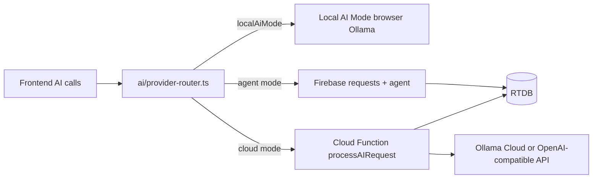

# CEO Compass — Phase 2–3 Design + Executable PR Plan

| Field | Value |
|-------|-------|
| **Document** | Phase 2 (Cloud AI & Platform) + Phase 3 (Learning Depth) |
| **Date** | 2026-07-16 |
| **Status** | **Implemented on `master`** (PRs 1–16) |
| **Prerequisite** | Phase 0–1 implemented (`docs/DESIGN_PHASE_0_1.md`); code on `master` |
| **Audience** | execute-plan implementers + human reviewers |

---

## Overview

Phase 0–1 made GitHub Pages a real product: Firebase persistence, anonymous + Google auth, `users/{uid}` trees, secure RTDB rules, Learn/Practice/Reflect IA, concept modularization, agent heartbeat, and export/import.

**Remaining gaps:**

1. **Production AI still depends on a local agent + Ollama** for non–Local-AI-Mode users.
2. **No App Check / rate limits / remote flags** — abuse and ops levers are thin.
3. **Learning loop is still shallow** — pathway is a sorted list, scenarios are few (6), spaced-repetition UX is basic.

This document designs Phase 2 and Phase 3 and ends with a **numbered PR Plan** that `/execute-plan` can parse and run end-to-end.

---

## Background & Motivation

### Current state (post Phase 0–1)

| Area | Status |
|------|--------|
| Persistence on Pages | `canUseFirebasePersistence` + anonymous auth + `users/{uid}` |
| RTDB rules | Owner private trees; create-only `requests` with `uid`; legacy device roots denied |
| AI | `lib/ai` + optional Local AI Mode; agent heartbeat UI |
| IA | Learn / Practice / Reflect; home Next Actions |
| Content | 57 frameworks / ~282 concepts; **6** scenarios |

### Pain

- Visitors on GitHub Pages cannot use AI unless *someone’s* agent is online.
- No server-side secrets path for cloud LLM keys (static export constraint).
- Pathway does not encode prerequisites or mastery.
- Scenario:concept coverage is sparse relative to the catalog.

---

## Goals & Non-Goals

### Goals

| ID | Goal |
|----|------|
| **2.1** | Pluggable AI providers: `local-agent` \| `local-browser` \| `cloud` |
| **2.2** | Cloud path works from GitHub Pages without a developer laptop agent |
| **2.3** | Request rate limiting + optional App Check hooks |
| **2.4** | Runtime feature flags via RTDB (not only build-time env) |
| **3.1** | Mastery graph: concept edges + next-best-action engine |
| **3.2** | Scenario pack expansion + explicit concept links |
| **3.3** | Deeper spaced-repetition UX (queue, session mode, stats) |
| **X.1** | Multi-device Google merge polish + operator runbook |

### Non-Goals

- Rewriting off Firebase RTDB / Next static export (unless a future Phase 4).
- Building a full multi-tenant SaaS billing system.
- Generating all 282 scenario packs in one PR (ship structure + seed packs).
- Replacing Ollama-only with a single vendor forever — keep provider interface.

---

## Proposed Design

### Phase 2 — AI provider model



**Default for production Pages:** `cloud` when `NEXT_PUBLIC_AI_PROVIDER=cloud` (or remote flag), else `agent` (current), with Local AI Mode override in Profile.

**Secrets:** Never put API keys in the static client. Cloud Function uses env secrets; frontend only calls callable HTTPS or writes a request that the Function processes.

**Minimal cloud request contract** (align with existing request shape):

```typescript
// requests/{requestId}
{
  uid: string
  status: "pending" | "processing" | "done" | "error"
  type: string
  category?: string
  payload: { model: string; prompt: string; stream?: boolean; options?: { temperature?: number } }
  created_at: number
  provider?: "agent" | "cloud"
}
```

Cloud Function: `onCreate` on `requests/{id}` when `provider === "cloud"` OR when no agent claims the request within N seconds (optional later). **Phase 2 PR prefers explicit `provider` field** set by the client router.

### Phase 2 — Rate limits & App Check

| Control | Mechanism |
|---------|-----------|
| Client | Debounce sparkle buttons; max concurrent AI ops (already partially present) |
| RTDB rules | Keep create-only + uid; optional validate `created_at` freshness |
| Function | Per-uid token bucket in RTDB `_rate/{uid}` (Admin SDK) |
| App Check | Firebase App Check (reCAPTCHA v3) enforced on RTDB/Functions when flag on |

### Phase 2 — Remote flags

RTDB path: `_config/feature_flags`

```json
{
  "ai_provider_default": "agent",
  "cloud_ai_enabled": false,
  "app_check_enforced": false,
  "mastery_graph_enabled": false,
  "sr_session_enabled": false
}
```

Frontend: `lib/feature-flags.ts` — subscribe `onValue`, cache, fall back to hardcoded safe defaults (`ai_provider_default: "agent"`, all booleans `false`).

### Phase 3 — Mastery graph

RTDB (or seed JSON pushed to RTDB):

```
mastery/
  edges/{fromConceptId}/{toConceptId} → { type: "requires"|"reinforces"|"applied_in", weight: number }
  concepts/{conceptId} → { frameworkSlug, conceptSlug, difficulty, tags[] }
```

Client engine `lib/mastery/next-action.ts`:

```typescript
type LearnerState = {
  viewed: Set<string>
  reviewed: Map<string, ReviewRecord>
  quizPctByFramework: Map<string, number>
  scenarioScores: Map<string, number>
}

function pickNextActions(state: LearnerState, graph: MasteryGraph, limit: number): NextAction[]
```

Wire into `useNextActions` + Pathway page when flag `mastery_graph_enabled`.

### Phase 3 — Scenario packs

- Extend `frontend/src/data/scenarios.json` (and optional RTDB `scenarios/{slug}`) with:
  - `pack_id`, `concept_ids[]`, `framework_slugs[]`
  - at least **+6** new scenarios (one pack) in seed PR
- UI: pack filter on `/scenarios`; scenario complete → optional auto SM-2 “hard” on missed concept ids

### Phase 3 — SR session UX

- New route `/review/session` (or modal on `/review`): due cards one-by-one, keyboard 1–4 for Again/Hard/Good/Easy
- Stats: retention estimate, streak of review days (local + RTDB)

---

## Key Decisions

| Decision | Choice | Rationale |
|----------|--------|-----------|
| Cloud AI entry | Firebase Cloud Function + secret API key | Static Pages cannot hold secrets |
| Provider selection | Router + remote flags + Profile override | Ops can flip without rebuild |
| App Check | Scaffold + flag; enforce later | Avoid blocking local dev |
| Mastery data | RTDB + seed script | Matches existing content pipeline |
| Scenarios | Expand static JSON first; optional RTDB later | Matches current `getScenarios` static path |
| execute-plan format | `### PR N: title` numeric | Required for execute-plan DAG parser |

---

## Alternatives Considered

1. **Browser-only cloud LLM with public key** — rejected (key theft).
2. **Always-on tunnel to home Ollama** — fragile; keep as optional agent mode.
3. **Full Firestore rewrite** — out of scope.
4. **Generate 50 scenarios with LLM in one PR** — quality risk; ship packs incrementally.

---

## Security & Privacy

- Cloud Function: auth required; verify `request.auth.uid === data.uid`.
- No prompt logging of PII beyond existing RTDB enrichment cache policy.
- App Check when enforced; document debug token for localhost.
- Rate limit denies after burst; surface friendly UI error.

---

## Observability

- Function logs: requestId, uid, provider, latency, error code.
- Client: AI status indicator already shows agent heartbeat; extend for cloud mode “Cloud AI”.
- Optional RTDB `_meta/cloud_worker_heartbeat` analogous to agent.

---

## Rollout

1. Ship provider interface defaulting to current agent behavior (no user-visible change).
2. Enable cloud behind remote flag for owner only.
3. Enable mastery graph behind flag.
4. Expand scenarios/SR after graph engine is stable.

---

## Open Questions (non-blocking defaults)

| # | Question | Default for implementers |
|---|----------|---------------------------|
| 1 | Cloud vendor | OpenAI-compatible HTTP API (`OPENAI_API_BASE` + `OPENAI_API_KEY`); model env `CLOUD_AI_MODEL` |
| 2 | Functions language | TypeScript `functions/` with firebase-functions v2 |
| 3 | Hosting | Keep GitHub Pages for UI; Functions on Firebase project only |

---

## References

- `docs/DESIGN_PHASE_0_1.md` — Phase 0–1 (implemented)
- `docs/possible_directions.md` — cloud / tunnel alternatives
- `frontend/src/lib/ai/*`, `frontend/src/lib/user-data/*`, `agent/index.js`
- `database.rules.json`, `Agents.md`

---

## PR Plan

Independently reviewable PRs for `/execute-plan`. Each PR must keep `frontend` typecheck + vitest green (`npx tsc --noEmit`, `npx vitest run`). Do not put secrets in the repo. Prefer small, testable steps.

**Parse format note:** Headings are `### PR N: …`. Dependencies use `None` or `PR N` lists.

---

### PR 1: AI provider types and router scaffold

- **Title:** `feat(ai): provider router scaffold with agent and local modes`
- **Files/components affected:** `frontend/src/lib/ai/provider.ts`, `frontend/src/lib/ai/router.ts`, `frontend/src/lib/ai/index.ts`, `frontend/src/lib/ai/transport.ts`, `frontend/src/lib/__tests__/ai-router.test.ts`, `frontend/src/lib/settings.ts` (optional provider preference)
- **Dependencies:** None
- **Description:** Introduce `AiProviderId = "agent" | "local" | "cloud"` and a pure router that selects provider from settings + env (`NEXT_PUBLIC_AI_PROVIDER`). Wire transport so existing `pushAiRequest` path is `agent`, Local AI Mode stays `local`, and `cloud` throws a clear “not configured” until PR 3. Default behavior must match today’s agent + local paths. Unit-test selection matrix.

---

### PR 2: Remote feature flags from RTDB

- **Title:** `feat(config): remote feature flags from RTDB _config/feature_flags`
- **Files/components affected:** `frontend/src/lib/feature-flags.ts`, `frontend/src/components/FeatureFlagsProvider.tsx`, `frontend/src/app/layout.tsx`, `frontend/src/lib/__tests__/feature-flags.test.ts`, `database.rules.json` (`_config` public read, admin write), `docs/ENGINEERING.md`
- **Dependencies:** None
- **Description:** Subscribe to `_config/feature_flags` with safe defaults when missing. Export `useFeatureFlags()` and `getFlag(key)`. Document flag keys: `ai_provider_default`, `cloud_ai_enabled`, `app_check_enforced`, `mastery_graph_enabled`, `sr_session_enabled`. Rules: `.read: true`, `.write` admin only. No behavior change until flags are true and consumers land.

---

### PR 3: Cloud AI Cloud Function skeleton

- **Title:** `feat(functions): processAIRequest Cloud Function for cloud provider`
- **Files/components affected:** `functions/package.json`, `functions/tsconfig.json`, `functions/src/index.ts`, `functions/src/llm.ts`, `functions/.env.example`, `firebase.json` (or document deploy), `docs/AI_CLOUD_SETUP.md`, `.gitignore` for functions secrets
- **Dependencies:** PR 1
- **Description:** Add Firebase Functions (TypeScript) that on RTDB `requests/{id}` create (or HTTPS callable) calls an OpenAI-compatible Chat/Completions or generate API using server env `OPENAI_API_KEY` / `OPENAI_API_BASE` / `CLOUD_AI_MODEL`. Write result to the same response paths the agent uses (`framework/...`, `conceptChats/...`, etc. via Admin SDK). Only process when `provider === "cloud"` or payload indicates cloud. Include dry local unit test of prompt→HTTP mock. Document deploy steps; do not commit API keys.

---

### PR 4: Frontend cloud provider integration

- **Title:** `feat(ai): wire cloud provider through router and Profile`
- **Files/components affected:** `frontend/src/lib/ai/transport.ts`, `frontend/src/lib/ai/router.ts`, `frontend/src/lib/ai/generators.ts` (if needed), `frontend/src/app/profile/page.tsx`, `frontend/src/components/AiStatusProvider.tsx`, `frontend/src/lib/__tests__/ai-router.test.ts`
- **Dependencies:** PR 1, PR 2, PR 3
- **Description:** When flags/settings select cloud, `pushAiRequest` sets `provider: "cloud"`. Profile shows provider radio/select: Agent / Local / Cloud (Cloud disabled unless `cloud_ai_enabled`). AiStatusIndicator shows “AI cloud” when cloud mode. Keep agent + local working. Tests for request payload includes provider field.

---

### PR 5: Per-uid AI rate limiting

- **Title:** `feat(ai): per-uid rate limit for AI requests`
- **Files/components affected:** `functions/src/rate-limit.ts`, `functions/src/index.ts`, `frontend/src/lib/ai/transport.ts`, `database.rules.json` (`_rate` admin-only), `frontend/src/lib/__tests__/rate-limit-message.test.ts` (or functions test)
- **Dependencies:** PR 3, PR 4
- **Description:** Implement token bucket or sliding window per uid (e.g. 20 requests / 10 minutes) using Admin SDK path `_rate/{uid}`. On limit, set request `status: error` with clear message; frontend surfaces it. Client-side pre-check optional. Document limits in ENGINEERING.md.

---

### PR 6: App Check scaffold

- **Title:** `feat(security): Firebase App Check scaffold with feature flag`
- **Files/components affected:** `frontend/src/lib/app-check.ts`, `frontend/src/lib/firebase.ts`, `frontend/src/components/FeatureFlagsProvider.tsx` or layout init, `docs/AI_CLOUD_SETUP.md` or `docs/ENGINEERING.md`, `.env.example` notes for reCAPTCHA site key
- **Dependencies:** PR 2
- **Description:** Initialize App Check when `NEXT_PUBLIC_APPCHECK_SITE_KEY` is set; only enforce when remote flag `app_check_enforced` is true (document that full enforcement also requires Firebase console). Do not break local dev without keys. Export `initAppCheckIfConfigured()`.

---

### PR 7: Mastery graph data model and seed

- **Title:** `feat(mastery): graph types, seed JSON, and RTDB seed script`
- **Files/components affected:** `frontend/src/lib/mastery/types.ts`, `frontend/src/data/mastery-edges.json` (or `frontend/src/data/mastery/`), `scripts/seed-mastery-graph.mjs`, `database.rules.json` (`mastery` public read, admin write), `docs/ENGINEERING.md`
- **Dependencies:** None
- **Description:** Define edges `{ from, to, type: requires|reinforces|applied_in, weight }`. Seed a minimal real graph covering at least 2 frameworks / ~15–30 concept edges derived from existing related_concepts where possible. Seed script uses Admin SDK like other seed tools. Rules: public read.

---

### PR 8: Mastery next-action engine

- **Title:** `feat(mastery): next-action engine with unit tests`
- **Files/components affected:** `frontend/src/lib/mastery/graph.ts`, `frontend/src/lib/mastery/next-action.ts`, `frontend/src/lib/mastery/load.ts`, `frontend/src/lib/__tests__/mastery-next-action.test.ts`, `frontend/src/lib/mastery/index.ts`
- **Dependencies:** PR 7
- **Description:** Load graph from RTDB or static JSON fallback. Implement `pickNextActions(learnerState, graph, limit)` prioritizing: due reviews, unblocking required edges, weak quiz frameworks, unseen high-centrality concepts. Pure functions + vitest fixtures. No UI yet.

---

### PR 9: Wire mastery into Next Actions and Pathway

- **Title:** `feat(mastery): integrate next actions into home and pathway`
- **Files/components affected:** `frontend/src/lib/user-data/useNextActions.ts`, `frontend/src/components/home/NextActionsDashboard.tsx`, `frontend/src/app/pathway/page.tsx`, `frontend/src/lib/feature-flags.ts` consumers, tests as needed
- **Dependencies:** PR 2, PR 8
- **Description:** When `mastery_graph_enabled`, home Next Actions includes graph-driven “Recommended concept” cards linking to `/frameworks/{slug}/{conceptSlug}`. Pathway page shows optional “Suggested next” from engine; keep legacy ordered list as fallback when flag off.

---

### PR 10: Scenario pack model and six new scenarios

- **Title:** `feat(scenarios): pack metadata and six new scenario definitions`
- **Files/components affected:** `frontend/src/data/scenarios.json`, `frontend/src/lib/types.ts` (Scenario pack fields), `frontend/src/lib/api.ts` if list mapping needs pack fields, `frontend/src/app/scenarios/page.tsx`
- **Dependencies:** None
- **Description:** Extend scenario type with optional `pack_id`, `pack_title`, `concept_ids: string[]`, `framework_slugs: string[]`. Add **6** new high-quality multi-stage scenarios spanning underrepresented domains (e.g. finance, negotiation, ops). UI: pack filter chips on scenarios browse page. Existing 6 scenarios keep working (default pack `core`).

---

### PR 11: Scenario completion links to spaced repetition

- **Title:** `feat(scenarios): map weak stages to concept review cards`
- **Files/components affected:** `frontend/src/components/ScenarioEngine.tsx`, `frontend/src/lib/user-data/reviews.ts` or new helper, `frontend/src/lib/types.ts`, tests
- **Dependencies:** PR 10
- **Description:** After scenario complete, if `concept_ids` present and score for a stage is low, offer “Add related concepts to review” that calls `markConceptReviewed` with rating Again/Hard or seeds a review record due immediately. Non-blocking UI; no errors if auth/persistence unavailable.

---

### PR 12: Spaced repetition session mode

- **Title:** `feat(review): keyboard-driven SR session mode`
- **Files/components affected:** `frontend/src/app/review/session/page.tsx` (or `frontend/src/app/review/page.tsx` + component), `frontend/src/components/review/ReviewSession.tsx`, `frontend/src/lib/feature-flags.ts` consumer, `frontend/src/app/review/page.tsx` entry CTA, tests
- **Dependencies:** PR 2
- **Description:** When `sr_session_enabled` (or always on if simpler), add “Start review session” that presents due concepts one at a time with Again/Hard/Good/Easy and keyboard shortcuts 1–4. Show session summary (count, ratings). Reuse `markConceptReviewed` / `loadDueReviews`. Accessible buttons + shortcuts.

---

### PR 13: Spaced repetition stats panel

- **Title:** `feat(review): retention stats and review streak`
- **Files/components affected:** `frontend/src/lib/user-data/review-stats.ts`, `frontend/src/app/review/page.tsx`, `frontend/src/lib/__tests__/review-stats.test.ts`
- **Dependencies:** PR 12
- **Description:** Compute from `loadAllReviews`: due/overdue/learning/mature counts, optional review-day streak (based on `lastReviewedAt`). Display compact stats on `/review`. Pure stats helpers unit-tested.

---

### PR 14: Multi-device Google account merge polish

- **Title:** `feat(auth): credential-in-use merge of anonymous user data`
- **Files/components affected:** `frontend/src/lib/AuthSessionProvider.tsx`, `frontend/src/lib/user-data/migrate.ts`, `frontend/src/app/profile/page.tsx`, tests if feasible
- **Dependencies:** None
- **Description:** When `linkWithPopup` fails with `auth/credential-already-in-use`, sign in with Google credential and merge `users/{anonUid}/…` into `users/{googleUid}/…` (reuse merge helpers from export-import or migrate), then delete or tombstone anon tree. Surface status toast/banner on Profile. Do not drop data silently.

---

### PR 15: Operator runbook and Phase 2–3 docs

- **Title:** `docs: operator runbook for cloud AI, flags, mastery seed, and purge`
- **Files/components affected:** `docs/OPERATOR_RUNBOOK.md`, `docs/AI_CLOUD_SETUP.md`, `README.md` (link section), `docs/ENGINEERING.md` (short links)
- **Dependencies:** PR 3, PR 2, PR 7
- **Description:** Single runbook: enable Anonymous auth, deploy rules, bootstrap admins, deploy functions + secrets, set feature flags in RTDB, seed mastery graph, purge legacy device data, verify AI status indicator modes. Keep steps copy-pasteable for Windows PowerShell and bash.

---

### PR 16: E2E smoke for learning loop

- **Title:** `test(e2e): Playwright smoke for next-actions and review session entry`
- **Files/components affected:** `frontend/e2e/learning-loop.spec.ts`, `frontend/playwright.config.ts` (if needed)
- **Dependencies:** PR 9, PR 12
- **Description:** Add Playwright tests that load home, assert next-actions region or empty state, navigate to review, assert session CTA or due section. Mock or skip Firebase if unavailable in CI; document required env. Must not flake main CI if e2e is optional job—prefer `test:e2e` script already present; keep vitest CI green.

---

## Suggested merge order (linearized)

```
PR1 → PR2 → PR3 → PR4 → PR5 → PR6
                ↘
PR7 → PR8 → PR9
PR10 → PR11
PR12 → PR13
PR14 (independent after Phase 0–1)
PR15 after PR2+PR3+PR7
PR16 after PR9+PR12
```

execute-plan will topologically sort; implementers should not invent extra scope.

---

## execute-plan invocation

From repo root (after this file is on the branch you want):

```text
/execute-plan docs/DESIGN_PHASE_2_3.md
```

Optional:

```text
/execute-plan docs/DESIGN_PHASE_2_3.md --concurrency 3
/execute-plan docs/DESIGN_PHASE_2_3.md --no-graphite --auto-pr
```

**Human ops not automated by execute-plan:** Firebase Console Anonymous auth, deploying Functions secrets, deploying RTDB rules to production, paying for cloud LLM usage.

---

*End of Phase 2–3 design + executable PR plan.*
